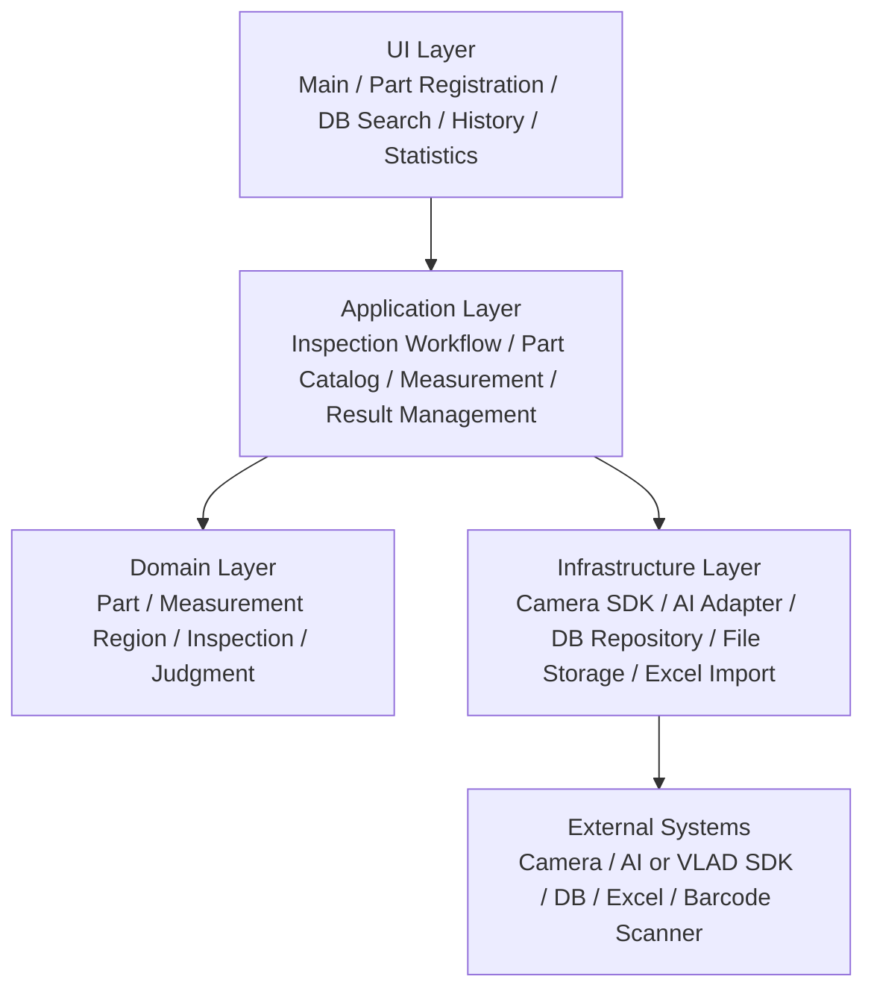
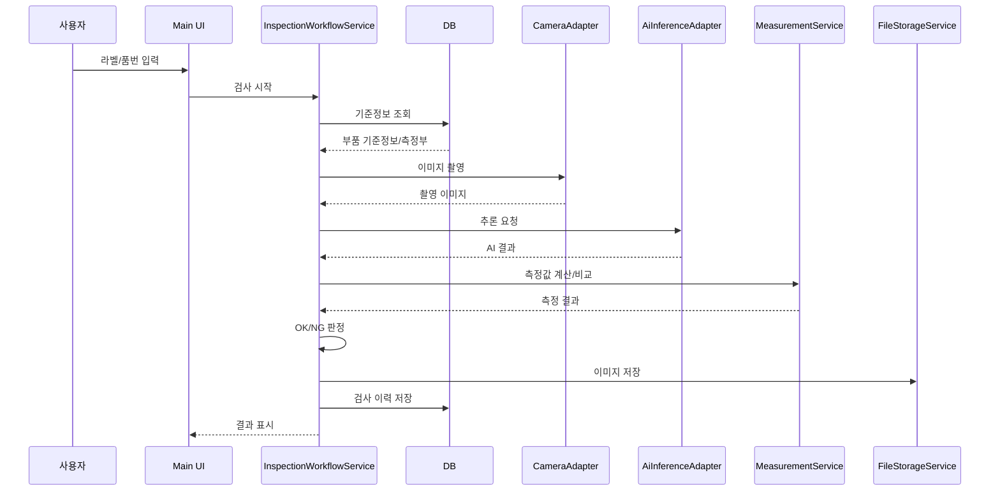

# 프로그램 구조

## 설계 방향

이 시스템은 C# Application에서 UI, 카메라, AI 추론, DB, 파일 저장, 통계를 연결하는 구조로 본다.
AI 모델 자체 개발보다 Application 워크플로우와 연동 안정성이 핵심이다.

## 권장 레이어

## 주요 모듈

| 모듈 | 역할 | 주요 책임 |
| --- | --- | --- |
| Main Inspection UI | 검사 실행 화면 | 품번/라벨 입력, 촬영, 판정 결과 표시, NG 표시 |
| Part Registration UI | 부품 등록 화면 | 기준정보 입력, 기준 이미지 촬영/등록, 측정부 정의 |
| DB Search/Edit UI | 기준정보 조회/수정 화면 | 부품 검색, 선택, 수정, 삭제, 엑셀 업로드 |
| History UI | 검사 이력 화면 | 검사 결과 조회, 이미지/로그 확인 |
| Statistics UI | 통계 화면 | 등록 부품수, 검사실적, OK/NG 수, 평균 검사시간 표시 |
| InspectionWorkflowService | 검사 흐름 제어 | 입력 조회, 촬영, AI 추론, 측정, 판정, 저장 순서 제어 |
| PartCatalogService | 기준정보 관리 | 부품 CRUD, 분류코드, 기준 이미지, 측정부 관리 |
| MeasurementService | 치수/측정부 처리 | 측정부 기준값 관리, 측정 결과 비교 |
| JudgmentService | 판정 로직 | AI 결과와 측정값을 종합해 OK/NG 결정 |
| ResultService | 이력 저장 | 검사 결과, 이미지 경로, 이벤트 로그 저장 |
| CameraAdapter | 카메라 연동 | SDK 호출, 이미지 수신, 연결 실패 처리 |
| AiInferenceAdapter | AI 연동 | 모델 추론 호출, 결과 파싱, Register/Unregister 필요 여부 반영 |
| Repository Layer | DB 접근 | 부품, 측정부, 검사 이력, 이벤트 CRUD |
| FileStorageService | 파일 저장 | 기준 이미지, 검사 이미지, NG 이미지, 보존/삭제 정책 |
| ExcelImportService | 일괄등록 | 엑셀 파싱, 데이터 검증, DB 반영 |

## 검사 워크플로우

## 측정부 설계 원칙

업무파악 정리파일에서 고객은 길이, 너비, 높이, 두께 고정 항목보다 이미지 위에 측정이 필요한
부위를 선으로 지정하고 첫 번째는 측정부, 두 번째부터 측정부2, 측정부3 형태로 표시하는 방식을 제안했다.

따라서 다음 방향을 기본으로 둔다.

- 부품 기준정보와 측정부를 1:N 관계로 분리한다.
- 측정부에는 이름, 이미지 뷰, 시작/끝 좌표, 기준값, 허용오차, 단위를 저장한다.
- 화면은 부품별 측정부 목록을 동적으로 표시한다.
- 기존 길이/너비/높이/두께 값은 기본 측정부 또는 호환 필드로 취급한다.

## 미확정 연동

| 항목 | 확인 필요 내용 |
| --- | --- |
| 카메라 | SDK 종류, 촬영 뷰별 카메라 수, 샘플 코드, 이미지 포맷 |
| AI | VLAD SDK 사용 여부, DLL/EXE/Python/REST 호출 방식, 입력/출력 스키마 |
| DB | DBMS 종류, 접속 방식, 기존 테이블 유무 |
| 라벨/바코드 | 스캐너 키보드 입력인지, QR/바코드 리더인지, 카메라 OCR인지 |
| 저장 정책 | 1개월 삭제인지 저장공간 기준 삭제인지 |
