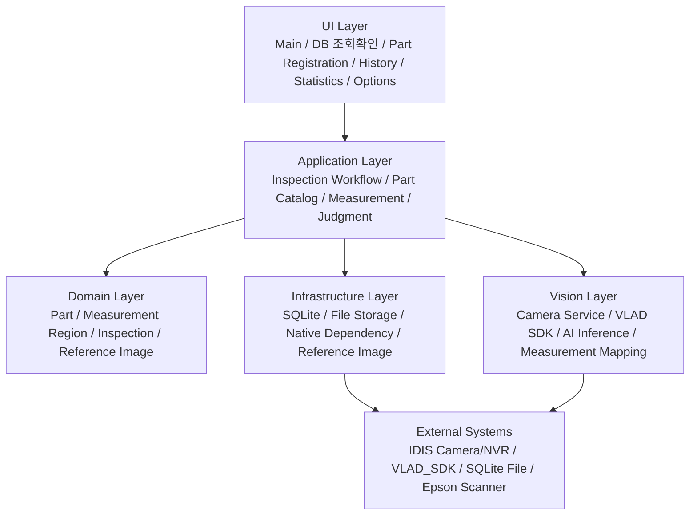
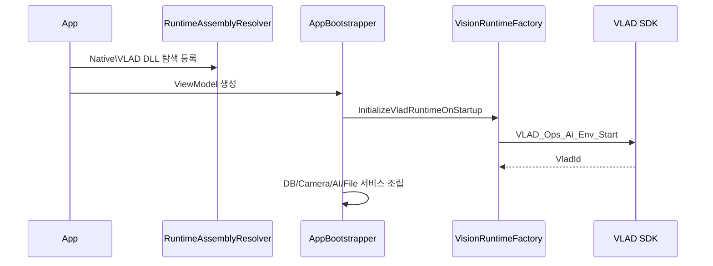
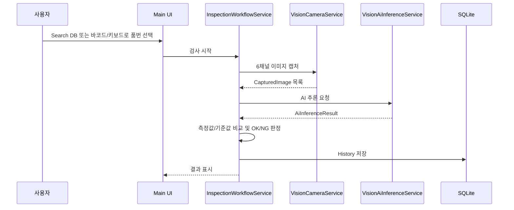

# 프로그램 구조

기준일: 2026-06-22

이 시스템은 C# WPF MVVM 애플리케이션에서 UI, 카메라, VLAD AI 추론, SQLite DB, 파일 저장, 통계를 연결하는 구조입니다. 현재 메인 솔루션은 `.NET Framework 4.7.2`, x64 전용입니다.

## 레이어 구조

## 주요 모듈

| 모듈 | 현재 역할 | 주요 책임 |
| --- | --- | --- |
| Main Inspection UI | 검사 실행 화면 | Search DB 작업대, 선택 부품 정보, 6방향 영상/이미지, 검사 시작, 기준 이미지 저장, OK/NG 표시 |
| DB 조회/확인 UI | 기준정보 조회 화면 | DB 부품 목록 검색, 선택 부품 측정부/기준 이미지 확인 |
| Part Registration UI | 기준정보 관리 화면 | 단일품목 등록/수정/삭제, 다중 CSV import/export, 기준 이미지 확인 |
| History UI | 검사 이력 화면 | 기간/키워드 검색, 측정값/기준값/NG 결과 확인 |
| Statistics UI | 통계 화면 | 등록 부품수, 검사 실적, OK/NG 집계 |
| Options UI | 설정 화면 | 카메라 설정 확인, 상태 새로고침, RTSP 연결 상태 확인 |
| InspectionWorkflowService | 검사 흐름 제어 | 부품 기준정보, 카메라 캡처, AI 추론, 측정/판정, 이력 저장 순서 제어 |
| PartCatalogService | 기준정보 관리 | 부품 CRUD, 분류코드 정합성, 기준 이미지, 측정부 관리 |
| MeasurementService | 치수 비교 | AI 측정값과 DB 기준값/허용값 비교, 단위 mm 기준 처리 |
| JudgmentService | 판정 로직 | 측정 결과와 AI 결과를 종합해 OK/NG 결정 |
| VisionCameraService | 카메라 연동 | RTSP/NVR/Direct SDK 후보 경계, 캡처 이미지 생성 |
| VisionAiInferenceService | AI 연동 | `VisionInferenceWorker` 스레드에 추론 요청, Application 결과로 변환 |
| VladVisionInferenceEngine | VLAD SDK 호출 | `VLAD_Inference_Mat`, `VLAD_Custom_InferenceData_V1` 호출과 결과 파싱 |
| Sqlite Repository | DB 접근 | `PartList_*`, `History_*` 테이블 CRUD |
| FileStorageService | 파일 저장 | 기준 이미지, 검사 이미지, 로그, 보존 정책 경계 |

## 앱 시작 흐름

## 검사 워크플로우

## 데이터 저장 구조

| 구분 | 위치 |
| --- | --- |
| SQLite DB | `DB\DataBase.db` |
| 부품 기준정보 | `PartList_Parts`, `PartList_Categories`, `PartList_MeasurementSets`, `PartList_MeasurementItems`, `PartList_ReferenceImages` |
| 검사 이력 | `History_Inspections`, `History_Measurements`, `History_CapturedImages`, `History_Events` |
| 기준 이미지 | `DB\Image\분류코드\품번\위치.png` |
| 검사 이미지 | `DB\History\yyyyMMdd\HH\분류코드\품번_품명_카메라위치_시간.ext` |
| 로그 | `DB\Logs` |

## 남은 미확정 연동

| 항목 | 확인 필요 내용 |
| --- | --- |
| VLAD 모델 | 최종 export 모델 구조, `VLAD_Custom_Registration` 성공 조건 |
| AI 결과 | 결과 문자열은 `true/false,score,measurement1...N` 형식으로 정리됨. parser는 score 정규화와 `IndexNo -> MeasurementRegion.Id` 매핑을 수행하며 측정값은 mm로 간주 |
| 카메라 | 6채널 장시간 RTSP/NVR 안정성, 실제 위치 매핑 |
| 보정 | pixel-mm 보정과 영상 기반 측정은 AI DLL 내부 책임. 애플리케이션은 AI가 반환한 숫자를 mm 측정값으로 비교 |
| 저장 정책 | 기간 또는 HDD 여유 공간 기준 History 자동 삭제 정책 |
