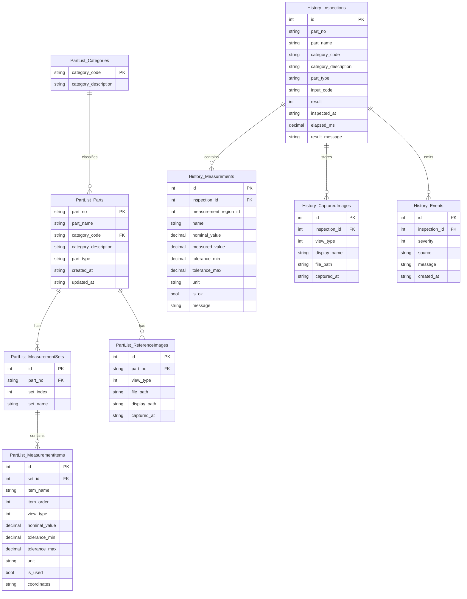

# 데이터 모델

기준일: 2026-06-22

DBMS는 SQLite로 확정했으며, 실제 파일은 `DB\DataBase.db`입니다. 기준정보는 `PartList_*`, 검사 이력은 `History_*` 테이블로 나누어 관리합니다.

## ERD



## 실제 테이블

| 테이블 | 목적 | 주요 필드 |
| --- | --- | --- |
| `SchemaInfo` | DB 스키마 버전 | schema_key, schema_value |
| `PartList_Categories` | 분류코드/분류설명 정합성 관리 | category_code, category_description |
| `PartList_Parts` | 부품 기준정보 | part_no, part_name, category_code, category_description, part_type |
| `PartList_MeasurementPoints` | 부품별 독립 측정부 1~5 | part_no, index_no, item_type, nominal_value, tolerance, x1, y1, x2, y2, line_color, unit |
| `PartList_MeasurementSets` | 이전 세트 구조 마이그레이션 원본 | part_no, set_index, set_name |
| `PartList_MeasurementItems` | 이전 길이/너비/높이/두께 구조 마이그레이션 원본 | item_name, nominal_value, tolerance_min, tolerance_max, unit, coordinates |
| `PartList_ReferenceImages` | Top/Front/Back/Left/Right/Thickness 기준 이미지 | part_no, view_type, file_path, display_path |
| `History_Inspections` | 검사 헤더 | part_no, part_name, result, inspected_at, elapsed_ms |
| `History_Measurements` | 검사 당시 측정값/기준값 | measured_value, nominal_value, tolerance, unit, is_ok |
| `History_CapturedImages` | 검사 캡처 이미지 | view_type, file_path, captured_at |
| `History_Events` | 검사 이벤트 로그 | severity, source, message, created_at |

## 파일 저장 구조

```text
DB\
  DataBase.db
  Image\
    Temp\
      {part_no}\
        {part_no}_Top.png
        {part_no}_Front.png
        {part_no}_Back.png
        {part_no}_Left.png
        {part_no}_Right.png
        {part_no}_Thickness.png
        {part_no}_coordinate.png
    {category_code}\
      {part_no}\
        {part_no}_Top.png
        {part_no}_Front.png
        {part_no}_Back.png
        {part_no}_Left.png
        {part_no}_Right.png
        {part_no}_Thickness.png
        {part_no}_coordinate.png
  History\
    yyyyMMdd\
      HH\
        {category_code}\
          {part_no}_{part_name}_{camera_position}_{HHmmssfff}.png
  Logs\
```

## 현재 설계 원칙

- 단위는 `mm`로 고정합니다.
- `ImageViewType`은 Top, Front, Back, Left, Right, Thickness, Unclassified를 정의합니다. Unclassified는 미분류 데이터 표현용이며 6채널 카메라 수와 기준 이미지 최대 6장 규칙에는 포함하지 않습니다.
- 측정부는 길이/너비/높이/두께 세트가 아니라 품목별 최대 5개의 독립 행으로 관리합니다.
- 각 측정부의 `item_type`은 길이/너비/높이/두께/미설정 중 하나이며 이력과 로그의 식별 정보로 사용합니다.
- `x1`, `y1`, `x2`, `y2`는 Thickness 기준 이미지의 원본 픽셀 좌표입니다.
- 좌표 선은 측정 위치 표시와 AI Crop 기준이며 선 자체의 픽셀 길이를 실제 mm 값으로 간주하지 않습니다.
- 스키마 v2 최초 실행 시 기존 `PartList_MeasurementSets/Items` 데이터를 품목별 최대 5개의 `PartList_MeasurementPoints`로 변환하고 원본 테이블은 보존합니다.
- 선 색상은 `line_color`에 `#RRGGBB` 형식으로 저장하며 기본 순서는 빨강, 주황, 노랑, 초록, 파랑입니다.
- 분류코드가 이미 존재하면 기존 분류설명과 입력 분류설명이 같을 때만 저장합니다.
- 기준 이미지 파일은 명시적 삭제/교체/현재6개저장/검사 중 신규등록 흐름 외에는 프로그램이 자동 삭제하지 않습니다.
- `현재6개저장`은 최종 기준 이미지를 즉시 교체하지 않고 `DB\Image\Temp\품번`에 작업본을 생성합니다.
- 측정부 위치를 확정하면 Temp의 Thickness 이미지 위에 전체 측정부 선을 합성한 `{품번}_coordinate.png`를 생성합니다.
- 기준 이미지와 좌표 이미지를 다시 저장할 때 OldVer 백업은 생성하지 않고 현재 파일을 교체합니다.
- 단일품목 `DB 저장` 시 Temp 작업본을 최종 품번 폴더로 확정하고 `PartList_ReferenceImages.captured_at`을 등록시간으로 갱신합니다. DB 저장 성공 후 Temp 작업 폴더를 삭제합니다.
- 검사는 하나의 실행 안에서 `AiInferenceResult.IsMatched` 이미지 AI 결과와 측정부별 측정값/기준값/허용값 비교 결과를 함께 확인해 최종 OK/NG를 판정합니다.
- 검사 이력은 부품 기준정보가 삭제되어도 삭제하지 않고, 추후 기간 또는 저장공간 정책으로 관리합니다.

## 보존 정책 미확정

| 설정 | 설명 |
| --- | --- |
| `RetentionMode` | `Days` 또는 `StorageLimit` |
| `RetentionDays` | 일수 기준 보존 기간 |
| `MaxStorageGb` | 저장공간 기준 최대 용량 |
| `DeleteOrder` | 오래된 검사부터 삭제 |
| `KeepNgImages` | NG 이미지 장기 보존 여부 |
