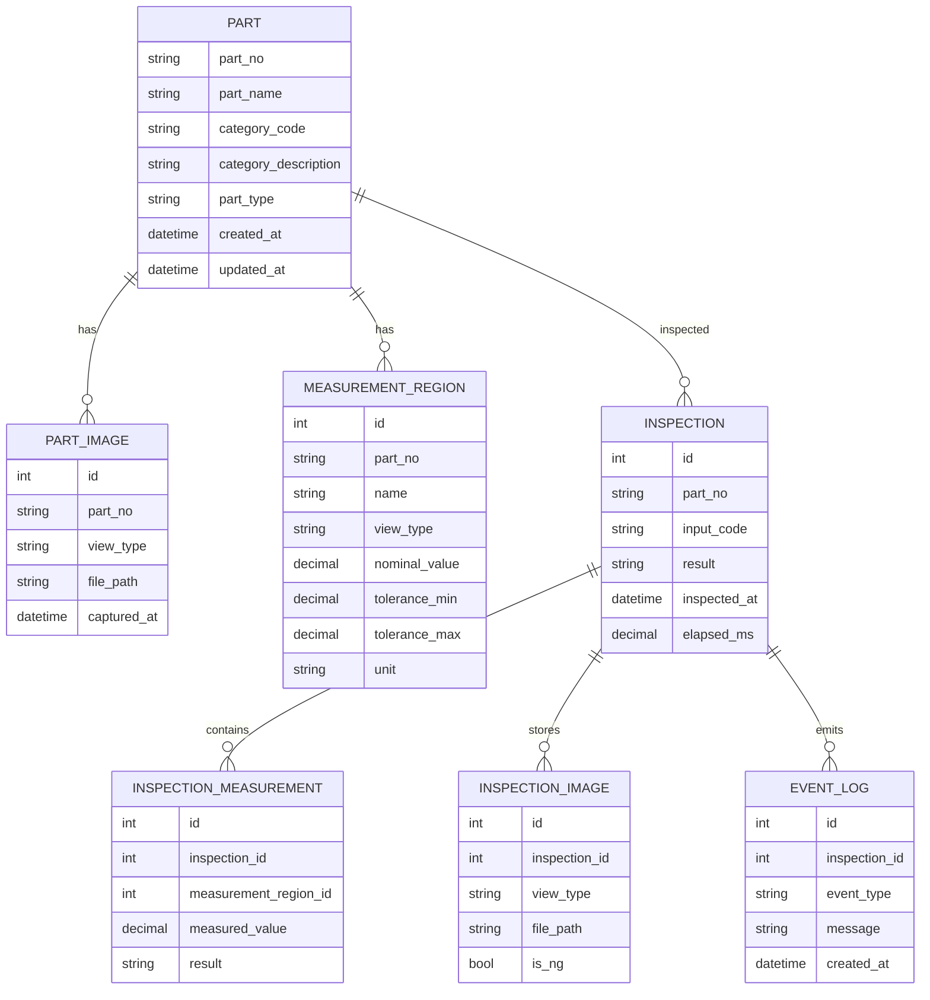

# 데이터 모델 초안

현재 자료만으로는 DBMS와 실제 테이블이 확정되지 않았다. 아래 구조는 요구사항을 빠뜨리지 않기 위한
논리 모델 초안이며, 기존 DB가 있으면 그 구조에 맞춰 조정한다.

## 핵심 엔티티



## 테이블 후보

| 테이블 | 목적 | 주요 필드 |
| --- | --- | --- |
| `parts` | 부품 기준정보 | part_no, part_name, category_code, category_description, part_type |
| `part_images` | 부품별 기준 이미지 | part_no, view_type, file_path, captured_at |
| `measurement_regions` | 부품별 측정부 | part_no, name, view_type, coordinates, nominal_value, tolerance, unit |
| `inspections` | 검사 실행 이력 | inspection_id, part_no, input_code, result, inspected_at, elapsed_ms |
| `inspection_measurements` | 검사별 측정값 | inspection_id, measurement_region_id, measured_value, result |
| `inspection_images` | 검사 이미지 | inspection_id, view_type, file_path, is_ng |
| `event_logs` | 이벤트 로그 | inspection_id, event_type, message, created_at |
| `import_batches` | 엑셀 일괄등록 이력 | batch_id, file_name, total_count, success_count, fail_count |

## 파일 저장 구조 후보

```text
Tests/AI-Vision IO Inspector/
DB/
  Image/
    {category_code}/
      {part_no}/
        {part_no}_Top.png
        {part_no}_Front.png
        {part_no}_Back.png
        {part_no}_Left.png
        {part_no}_Right.png
        {part_no}_Thickness.png
        {part_no}_Top_OldVer_yyyyMMdd_HHmmssfff.png
RuntimeData/
  InspectionLogs/
  Inspections/
```

## 저장 정책

현재 자료에는 검사 이력을 최대 1개월 지원하는 안과 저장공간 기준 삭제로 변경 검토하는 안이 함께 존재한다.
따라서 구현 시 다음을 설정값으로 분리한다.

| 설정 | 설명 |
| --- | --- |
| `RetentionMode` | `Days` 또는 `StorageLimit` |
| `RetentionDays` | 일수 기준 보존 기간 |
| `MaxStorageGb` | 저장공간 기준 최대 용량 |
| `DeleteOrder` | 오래된 검사부터 삭제 |
| `KeepNgImages` | NG 이미지 장기 보존 여부 |
