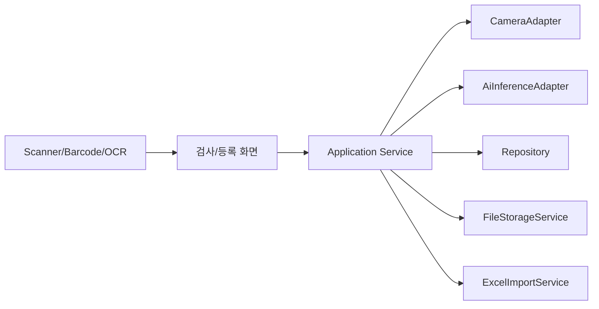

# 연동 명세 초안

카메라, AI 모델, DB, 라벨/바코드, 엑셀 업로드 연동을 구현하기 위한 확인 항목과 Application 내부 경계다.

## 2026-05-29 카메라 사양 확정

| 장비 | 수량 | 사양 | 설계 반영 |
| --- | ---: | --- | --- |
| DC-T3145G Global Shutter Network Camera | 2 | 5M, 최대 2448x2048, 6:5/4:3/16:9 지원 | 움직임/트리거 영향이 큰 위치에 우선 배치 |
| DC-T3145R Rolling Shutter Camera | 4 | 5M, 최대 2592x1944, Max 30fps, 4:3 중심 | 정지 또는 움직임 영향이 낮은 위치에 배치 |
| DR-2508P-A NVR | 1 | 8CH Direct IP NVR, 2TB 내장 | 녹화/모니터링/백업 경로. 측정 원본은 직접 카메라 SDK 우선 검토 |

세부 분석과 권장 구조는 `Tests\AI-Vision IO Inspector\AI.Vision.IOInspector.Vision\Docs\camera-ai-integration.md`에서 관리한다.

## 연동 구성

## 카메라 연동

| 항목 | 내용 | 상태 |
| --- | --- | --- |
| SDK 종류 | DC-T3145G/R이 `MVSDK_Net`/`IMV` 계열과 호환되는지 실제 설치본으로 검증한다. 구현 위치는 `ImvCameraDevice`, `ImvCameraManager`다. | 미구현-외부정보필요 |
| 촬영 방식 | 6대 카메라를 ViewType별로 운용한다. 측정 원본은 Direct SDK, NVR은 녹화/모니터링 보조로 둔다. | 방향확정 |
| 트리거 | `CameraTriggerMode`로 Continuous/Software/Line1을 관리한다. 현장 동시/순차/외부 트리거 방식은 확정 필요하다. | 미구현-외부정보필요 |
| 연속 미리보기 | 요청 기반 Capture Worker와 별개로 최신 프레임 유지 Worker를 둔다. 모든 프레임을 파일로 저장하지 않는다. | 미구현-내부작업 |
| 이미지 포맷 | 원본 프레임 width/height/stride/pixel format은 `VisionFrame`에 보존한다. 기준/이력 파일 저장은 png 우선으로 유지한다. | 부분완료-검증필요 |
| 실패 처리 | 연결 실패, 촬영 실패, 타임아웃을 별도 이벤트로 기록한다. 실제 SDK 오류 코드 매핑은 장비 확보 후 진행한다. | 부분완료-검증필요 |

## AI 연동

| 항목 | 내용 | 상태 |
| --- | --- | --- |
| 호출 방식 | 현재 방향은 VLAD SDK/DLL 우선이다. 기존 함수명은 `VLAD_Ops_Ai_Compat`, 실제 구현은 `VladRuntimeContext`에 둔다. | 미구현-외부정보필요 |
| 입력 | 현재 표준 입력은 `VisionInspectionInput`이다. 실제 VLAD 호출 시 `VisionFrame` 또는 이미지 파일을 Mat/raw buffer로 변환한다. | 부분완료-검증필요 |
| 출력 | `VisionInspectionOutput.Measurements`로 변환한다. class/bbox/mask/keypoint/치수 반환 스키마는 AI 담당자 확인이 필요하다. | 미구현-외부정보필요 |
| Register/Unregister | Register/WarmUp/Unregister/Class API를 Application에서 직접 호출해야 하는지 확인 후 `VladRuntimeContext`에 구현한다. | 미구현-외부정보필요 |

## DB 연동

| 항목 | 내용 | 상태 |
| --- | --- | --- |
| DBMS | SQLite `DB\DataBase.db`를 사용한다. `export_Test.csv`는 1회성 적재 원본이며 실행 종속성으로 두지 않는다. | 완료 |
| 기준정보 | 부품, 기준 이미지, 측정부를 저장한다. 앱 메모리는 `PartDataStore` 캐시와 동기화한다. | 완료 |
| 검사 이력 | 결과, 측정값, 이미지 경로, 이벤트를 저장한다. 보관기간/저장공간 정책을 적용한다. | 부분완료-검증필요 |
| 통계 | 기본 통계는 구현했다. 기간/품목 필터의 고객 기준은 추가 확인한다. | 부분완료-검증필요 |

## 라벨/바코드 입력

입력 방식이 확정되지 않았으므로 Application에서는 입력값을 `InspectionInput`으로 표준화한다.

| 방식 | 구현 영향 |
| --- | --- |
| 키보드 웨지 스캐너 | TextBox 입력 이벤트 처리 중심 |
| 전용 바코드 SDK | 장치 연결/해제와 콜백 처리 필요 |
| 카메라 OCR | 영상 처리 또는 AI/OCR 연동 범위 증가 |
| 수동 입력 | 디버깅/운영 보조 기능으로 유지 가능 |

## 엑셀 일괄등록

| 항목 | 내용 |
| --- | --- |
| 지원 형식 | 요구사항 이미지 기준 xlsx, xlsm, xlsb 후보 |
| 처리 방식 | 업로드, 컬럼 검증, 행별 검증, 미리보기, DB 반영 |
| 오류 처리 | 실패 행 번호, 필드명, 사유 표시 |
| 이력 | 업로드 파일명, 처리 건수, 성공/실패 건수 저장 |
