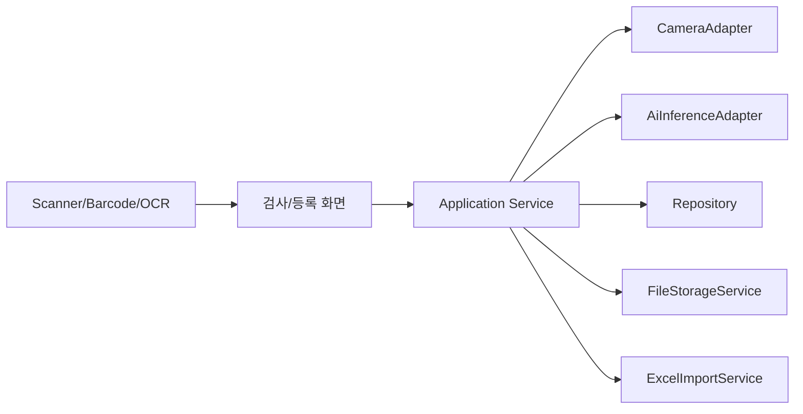

# 연동 명세 초안

카메라, AI 모델, DB, 라벨/바코드, 엑셀 업로드 연동을 구현하기 위한 확인 항목과 Application 내부 경계다.

## 연동 구성

## 카메라 연동

| 항목 | 내용 | 상태 |
| --- | --- | --- |
| SDK 종류 | 확인 필요 | 대기 |
| 촬영 방식 | 6방향 개별 촬영인지, 단일 카메라 순차 촬영인지 확인 필요 | 대기 |
| 이미지 포맷 | png, jpg, bmp, raw 여부 확인 필요 | 대기 |
| 실패 처리 | 연결 실패, 촬영 실패, 타임아웃을 별도 이벤트로 기록 | 설계 |

## AI 연동

| 항목 | 내용 | 상태 |
| --- | --- | --- |
| 호출 방식 | DLL, SDK, EXE, Python, REST API 중 확인 필요 | 대기 |
| 입력 | 촬영 이미지 경로 또는 이미지 바이트 | 확인 필요 |
| 출력 | 클래스, 신뢰도, OK/NG, 불일치 위치, 측정 보조값 여부 확인 | 대기 |
| Register/Unregister | Application에서 직접 호출해야 하는지 확인 필요 | 대기 |

## DB 연동

| 항목 | 내용 | 상태 |
| --- | --- | --- |
| DBMS | 확인 필요 | 대기 |
| 기준정보 | 부품, 기준 이미지, 측정부 저장 | 요구 |
| 검사 이력 | 결과, 측정값, 이미지 경로, 이벤트 저장 | 요구 |
| 통계 | 기간별 집계 쿼리 필요 | 추가 요청 |

## 라벨/바코드 입력

입력 방식이 확정되지 않았으므로 Application에서는 입력값을 `InspectionInput`으로 표준화한다.

| 방식 | 구현 영향 |
| --- | --- |
| 키보드 웨지 스캐너 | TextBox 입력 이벤트 처리 중심 |
| 전용 바코드 SDK | 장치 연결/해제와 콜백 처리 필요 |
| 카메라 OCR | 영상 처리 또는 AI/OCR 연동 범위 증가 |
| 수동 입력 | 디버깅/운영 보조 기능으로 유지 가능 |

## 엑셀 일괄등록

| 항목 | 내용 |
| --- | --- |
| 지원 형식 | 요구사항 이미지 기준 xlsx, xlsm, xlsb 후보 |
| 처리 방식 | 업로드, 컬럼 검증, 행별 검증, 미리보기, DB 반영 |
| 오류 처리 | 실패 행 번호, 필드명, 사유 표시 |
| 이력 | 업로드 파일명, 처리 건수, 성공/실패 건수 저장 |
