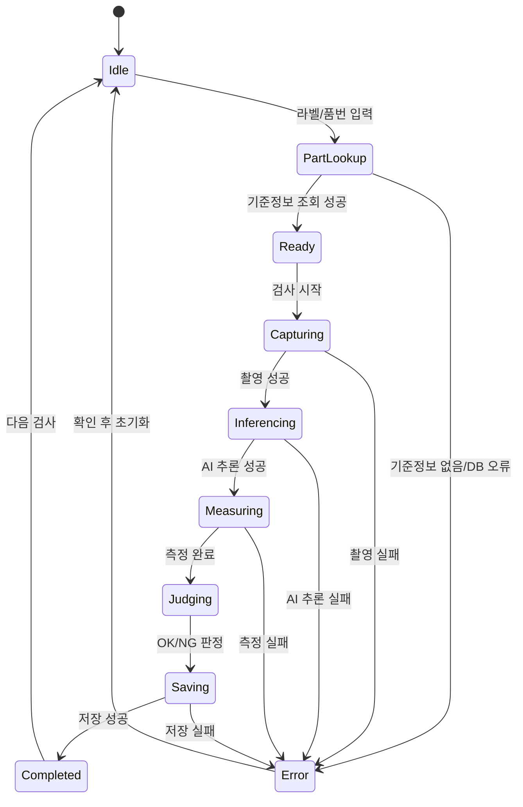
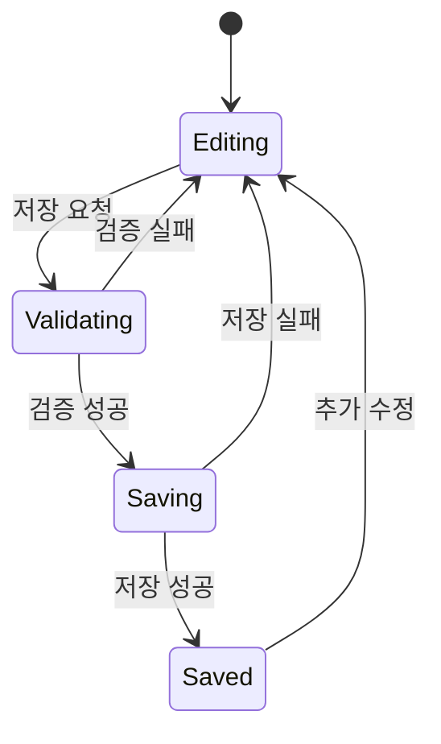
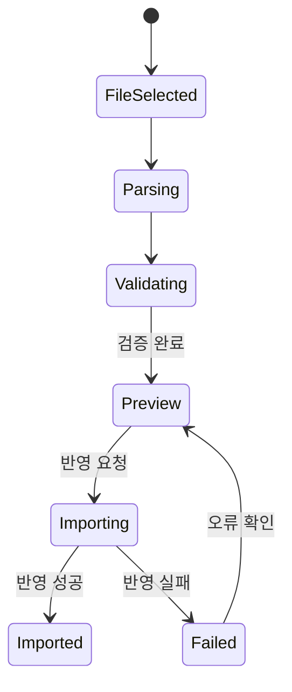

# 상태 흐름

검사 실행, 부품 등록, 엑셀 업로드의 주요 상태를 정의한다.

## 검사 상태

## 검사 상태 정의

| 상태 | 의미 | 사용자 표시 |
| --- | --- | --- |
| Idle | 입력 대기 | 대기 |
| PartLookup | 기준정보 조회 중 | 조회중 |
| Ready | 기준정보 준비 완료 | 검사 가능 |
| Capturing | 카메라 촬영 중 | 촬영중 |
| Inferencing | AI 추론 중 | 판정중 |
| Measuring | 치수 측정 중 | 측정중 |
| Judging | OK/NG 판정 중 | 판정중 |
| Saving | 결과 저장 중 | 저장중 |
| Completed | 검사 완료 | OK 또는 NG |
| Error | 오류 발생 | 오류 메시지 |

## 부품 등록 상태

## 엑셀 업로드 상태

