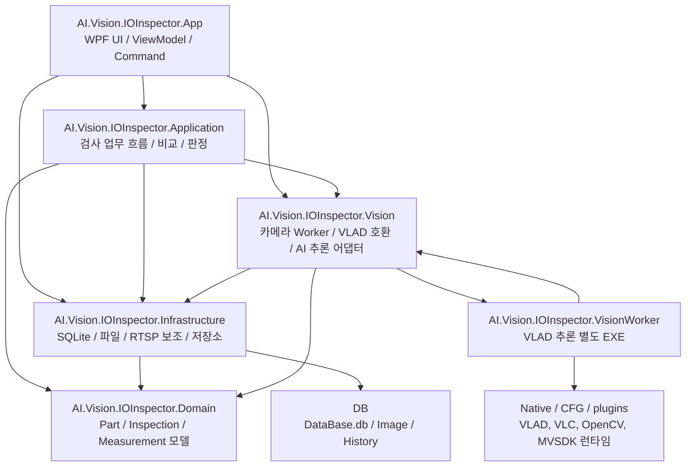
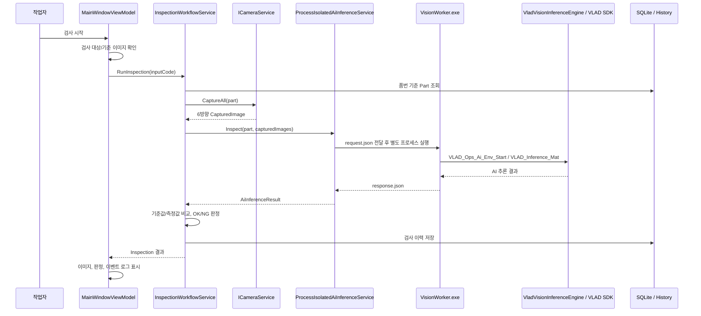
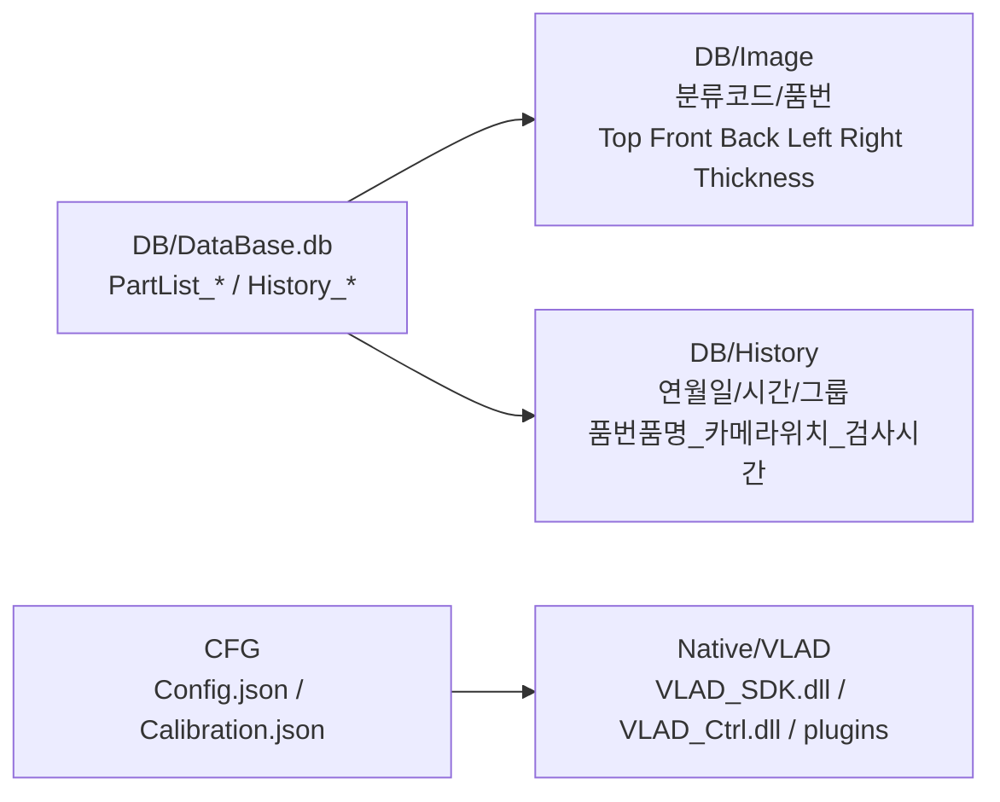
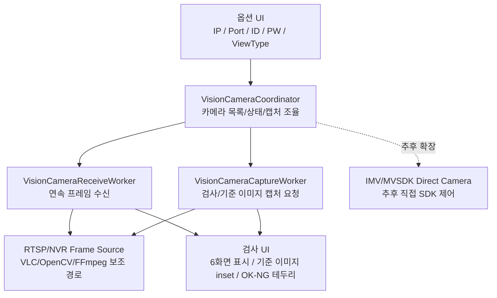

> 참고: 이 문서는 해당 날짜의 기록입니다. 최신 구조는 project-structure-2026-06-22.md를 기준으로 확인합니다.

# 프로젝트 구조도 - 2026-06-16

이 문서는 `AI-Vision IO Inspector`의 현재 코드 구조, 실행 흐름, 저장 구조, 미비/추가 개발 항목을 한 화면에서 파악하기 위한 기준 문서입니다.

## 전체 폴더 구조

```text
AI-Vision IO Inspector
|-- Docs
|   |-- 00-inbox
|   |   |-- documents
|   |   `-- mail
|   |-- 01-project
|   |-- 02-requirements
|   |-- 03-development
|   |   |-- project-structure-2026-06-16.md
|   |   |-- open-items.md
|   |   |-- changelog.md
|   |   |-- work-log.md
|   |   `-- vision
|   |       |-- README.md
|   |       |-- vision-implementation-checklist.md
|   |       |-- native-deployment.md
|   |       |-- vlad-ops-gap-analysis-2026-06-11.md
|   |       `-- vlad-ops-env-start-map-2026-06-15.md
|   `-- 04-operations
|-- Src
|   `-- 안정화된 버전 복사/관리 대상
`-- Tests
    `-- AI-Vision IO Inspector
        |-- AI.Vision.IOInspector.sln
        |-- AI.Vision.IOInspector.App
        |-- AI.Vision.IOInspector.Application
        |-- AI.Vision.IOInspector.Domain
        |-- AI.Vision.IOInspector.Infrastructure
        |-- AI.Vision.IOInspector.Vision
        |-- AI.Vision.IOInspector.VisionWorker
        |-- CFG
        |-- DB
        |-- Native
        |-- RuntimeData
        `-- publish
```

## 솔루션 프로젝트 구조



## 프로젝트별 책임과 미비 항목

| 프로젝트 | 현재 책임 | 주요 진입점 | 미비/추가 개발 |
| --- | --- | --- | --- |
| `AI.Vision.IOInspector.App` | WPF 화면, 탭, 검사 시작/초기화, 검색, 기준 이미지 표시, 이력/통계/옵션 UI | `MainWindow.xaml`, `MainWindowViewModel.cs`, `AppBootstrapper.cs` | 6채널 실시간 영상 장시간 표시 검증, 고객 최종 UI 피드백 반영, 통계 화면 고객 기준 필터 확정 |
| `AI.Vision.IOInspector.Application` | 검사 순서 제어, 카메라 캡처 호출, AI 추론 호출, 측정값 비교, OK/NG 판정, 이력 저장 요청 | `InspectionWorkflowService.cs`, `MeasurementService.cs`, `JudgmentService.cs` | AI 결과 스키마 확정 후 측정부별 NG 사유 표시 고도화 |
| `AI.Vision.IOInspector.Domain` | 부품, 측정부, 기준 이미지, 검사 결과, 이벤트 모델 | `Part.cs`, `MeasurementRegion.cs`, `Inspection.cs`, `CapturedImage.cs` | 두께 복수 측정 요구가 확정되면 모델 확장 필요 |
| `AI.Vision.IOInspector.Infrastructure` | SQLite, 기준 이미지 파일 관리, 검사 이력 저장, 카메라 설정/RTSP 보조 구현, History 이미지 경로 관리 | `SqliteDatabase.cs`, `SqlitePartRepository.cs`, `SqliteInspectionRepository.cs`, `ReferenceImageFileService.cs`, `RuntimeImagePathSettings.cs` | 장비 PC 배포 경로 검증, History 보관 정책 현장 기준 확정, Excel 직접 업로드 필요 여부 확인 |
| `AI.Vision.IOInspector.Vision` | 카메라 Coordinator/Worker, RTSP/IMV/VLAD 호환 계층, VLAD 추론 엔진, 결과 파서, isolated DTO | `VisionRuntimeFactory.cs`, `VisionCameraCoordinator.cs`, `VladVisionInferenceEngine.cs`, `LegacyVlad/*`, `Isolation/*` | VLAD 최종 모델 등록/추론, detectData 치수 스키마, pixel-mm 보정, RTSP stop API 확인, 렌즈 왜곡 보정 |
| `AI.Vision.IOInspector.VisionWorker` | VLAD SDK 추론을 WPF 본체 밖에서 실행하는 별도 프로세스 | `Program.cs` | CUDA Toolkit 11.0 Runtime(`cudart64_110.dll`) 설치, cuDNN/BLAS 추가 의존성 확인, 실제 모델 응답 JSON 검증 |
| `RuntimeData\Probe\RtspProbe` | RTSP 연결/프레임 수신 진단용 보조 프로젝트 | `RtspProbe.csproj`, `Program.cs` | 운영 앱 기능은 아니며, 네트워크/카메라 진단용으로만 관리 |

## 검사 실행 흐름



## 데이터 저장 구조



| 저장 대상 | 현재 위치 | 관리 기준 | 미비/추가 개발 |
| --- | --- | --- | --- |
| 부품 기준정보 | `Tests/AI-Vision IO Inspector/DB/DataBase.db` | SQLite, 품번/품명/분류코드/분류설명/구분/측정부/기준 이미지 | 분류코드-분류설명 불일치 차단은 구현 방향 유지, 고객 최종 데이터로 재검증 |
| 기준 이미지 | `DB/Image` | Top/Front/Back/Left/Right/Thickness 6개 위치를 유니크하게 관리 | 기준 이미지를 AI가 직접 비교하는지, 화면 가이드로만 쓰는지 확정 필요 |
| 검사 이미지 | `DB/History` | 연월일/시간/그룹 단위로 분산 저장 | 운영 PC에서는 별도 HDD 경로를 `Config.json` 또는 환경 설정으로 지정해야 함 |
| 검사 이력 | `History_Inspections`, `History_Measurements`, `History_CapturedImages`, `History_Events` | 헤더/측정값/이미지/이벤트 분리 저장 | 보관 기간, HDD 여유 공간 기준 삭제 정책 현장 기준 확정 |
| Native DLL | `Native/VLAD`, `RuntimeData/Native`, CUDA 11.0 Runtime | VLAD/VLC/OpenCV/MVSDK/TensorFlow 런타임 | 개발툴 없는 PC에서 EXE 단독 실행, CUDA PATH, cuDNN DLL 로드 검증 필요 |

## 카메라/Vision 구조



## 현재 완료된 주요 항목

| ID | 완료 내용 | 근거 |
| --- | --- | --- |
| C-001 | C#에서 모델 폴더 구조를 선차단하지 않고 VLAD SDK 등록 결과를 따르도록 정리 | `VladVisionInferenceEngine`, `VladModelPathInspector` |
| C-002 | RTSP Thread가 직접 VLAD 등록을 새로 만들지 않고 기존 VLAD_ID를 사용하는 방향으로 정리 | `VladSdkSession`, `VisionCameraCoordinator` |
| C-003 | VLAD 호환 진입점과 P/Invoke 선언 추가 | `LegacyVlad/VLAD_Ops_Ai.cs`, `VladNativeMethods.cs` |
| C-004 | 측정값이 없을 때 기준값으로 위장하지 않도록 변경 | `VladMeasurementMapper` |
| C-005 | AI 추론을 WPF 본체 밖 `VisionWorker.exe`로 분리 | `ProcessIsolatedAiInferenceService`, `AI.Vision.IOInspector.VisionWorker` |
| C-006 | 검사 UI 화면 초기화 버튼, 검색 추천 조건부 표시, 결과 메시지 위치 개선 | `MainWindow.xaml`, `MainWindowViewModel.cs` |

## 남은 미비/추가 개발 항목

| ID | 영역 | 상태 | 현재 판단 | 다음 작업 | 완료 기준 |
| --- | --- | --- | --- | --- | --- |
| O-001 | 카메라/NVR RTSP 연결 | 부분완료-검증필요 | Top/Front 프레임 수신은 확인했지만 6채널 장시간 스트리밍 검증은 남음 | 실제 6대 연결 후 검사 UI 연속 표시와 상태 갱신 확인 | 6채널 모두 `연결됨`, 프레임 갱신, 오류 로그 없음 |
| O-002 | 연속 영상 미리보기 | 진행중 | 검사 UI에 스트리밍 표시 방향 | 최신 프레임 캐시와 UI 표시 주기 안정화 | 수동 스냅샷 없이 계속 갱신 |
| O-003 | 트리거 방식 | 미구현-외부정보필요 | Continuous/Software/Line1 구조는 있으나 현장 트리거 정책 미확정 | 장비 배선과 검사 시작 신호 방식 확인 | 옵션 값에 따라 SDK 트리거 호출 검증 |
| O-004 | pixel-mm 보정 | 미구현-내부작업 | `Calibration.json` 구조는 있으나 실제 보정값 없음 | 카메라별 mm/pixel 또는 보정판 절차 확정 | pixel 기반 측정값이 mm 기준값과 비교 가능 |
| O-005 | 렌즈 왜곡 보정 | 미구현-외부정보필요 | 카메라/렌즈/설치 거리 기준 필요 | 보정 필요 여부와 파라미터 취득 방식 결정 | 보정 파라미터 저장/적용 경로 구현 |
| O-006 | VLAD 최종 모델 등록/추론 | 미구현-외부정보필요 | checkpoint-only 폴더는 VLAD_SDK 추론 모델 구조가 아님 | AI 담당자가 SavedModel/ONNX/PT/T7 구조로 export | `VLAD_Custom_Registration` 성공 및 샘플 이미지 추론 성공 |
| O-007 | VLAD/AI 결과 파싱 | 진행중 | SDK Draw 결과를 기본 사용, raw detectData 직접 파싱은 crash 위험 때문에 opt-in | 길이/너비/높이/두께 반환 규격 확정 | 측정부별 측정값/NG 사유가 이력에 저장 |
| O-008 | 기준 이미지 비교 정책 | 미구현-외부정보필요 | 기준 이미지를 AI가 직접 비교하는지 참고 이미지로만 쓰는지 미확정 | AI 담당자와 비교/판정 책임 범위 결정 | 검사 시작 시 기준 이미지와 현재 이미지 사용 방식 확정 |
| O-009 | RTSP Thread 종료 | 미구현-외부정보필요 | 원본 VLAD_Ops에도 명확한 client stop API가 보이지 않음 | VLAD SDK 담당자에게 unregister/stop API 확인 | 앱 종료/재설정 시 RTSP thread 누수 없음 |
| O-010 | 장비 PC 배포 | 부분완료-검증필요 | Native/VLAD, plugins, Config 복사 구조 있음 | 개발툴 없는 PC에서 publish 산출물 실행 | EXE 단독 실행, DLL 로드, DB/History 경로 정상 |
| O-011 | 통계 화면 | 부분완료-검증필요 | 기본 통계 화면은 있으나 고객 기준 필터 확정 필요 | 기간/품번/NG 유형 기준 확인 | 고객 기준 통계가 실제 이력과 일치 |
| O-012 | Excel 직접 업로드 | 보류-범위조정 | 현재는 CSV 다중등록 중심 | xlsx 직접 지원 필요 여부 확인 | 범위 확정 후 구현 또는 제외 기록 |
| O-013 | 두께 복수 측정 | 보류-범위조정 | 현재는 길이/너비/높이/두께 1세트 기본 | 두께가 2개 이상 필요한 품목 사례 확인 | DB/UI/CSV에 복수 두께 구조 반영 |
| O-014 | VLAD/TensorFlow CUDA 런타임 의존성 | 미구현-외부정보필요 | `cudart64_110.dll`은 CUDA Runtime 11.0 DLL이며 현재 PATH에서 미탐지 | CUDA Toolkit 11.0 Update 1 설치, `where cudart64_110.dll` 확인, `cudnn64_8.dll` 등 추가 DLL 요구 여부 확인 | VisionWorker 또는 앱 내 VLAD 초기화가 정상 등록되고 검사 결과가 UI에 표시됨 |

## 우선 개발 순서 제안

1. `O-014` VLAD/TensorFlow 런타임 의존성 해결
2. `O-006` 최종 VLAD 모델 구조 확정 및 등록 성공 확인
3. `O-007` AI 결과 스키마 확정과 길이/너비/높이/두께 매핑 구현
4. `O-001`, `O-002` 6채널 장시간 스트리밍 안정화
5. `O-004`, `O-005` pixel-mm/렌즈 보정 절차 확정
6. `O-008` 기준 이미지 비교 정책 확정
7. `O-010` 개발툴 없는 장비 PC 배포 검증

## 개발자가 먼저 읽을 문서

| 대상 | 문서 |
| --- | --- |
| 전체 구조 | `Docs/03-development/project-structure-2026-06-16.md` |
| 남은 항목 | `Docs/03-development/open-items.md` |
| Vision 담당자 | `Docs/03-development/vision/README.md` |
| VLAD 구현 차이 | `Docs/03-development/vision/vlad-ops-gap-analysis-2026-06-11.md` |
| VLAD Env Start 대응 | `Docs/03-development/vision/vlad-ops-env-start-map-2026-06-15.md` |
| Native 배포 | `Docs/03-development/vision/native-deployment.md` |
| 변경 이력 | `Docs/03-development/changelog.md` |
