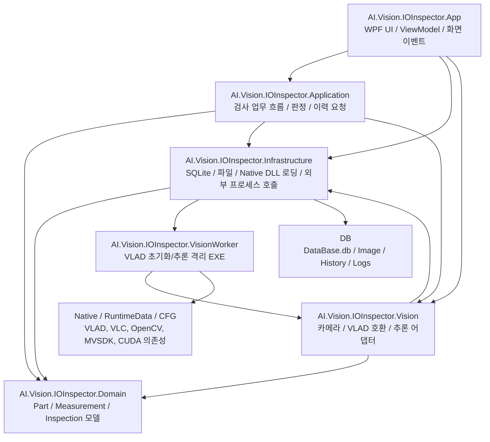
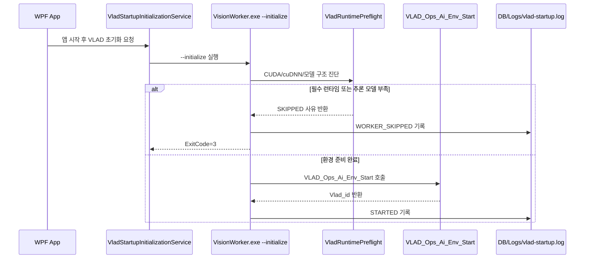
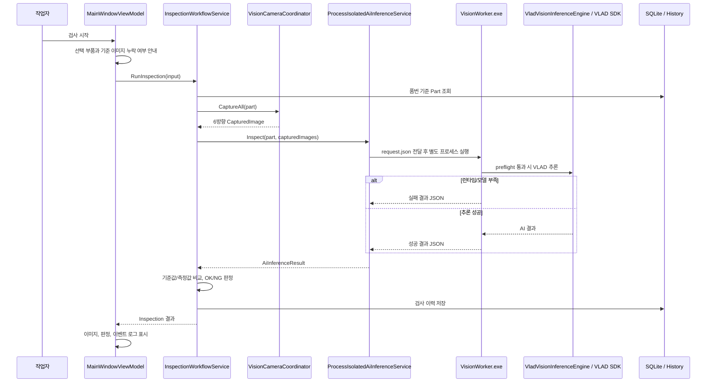
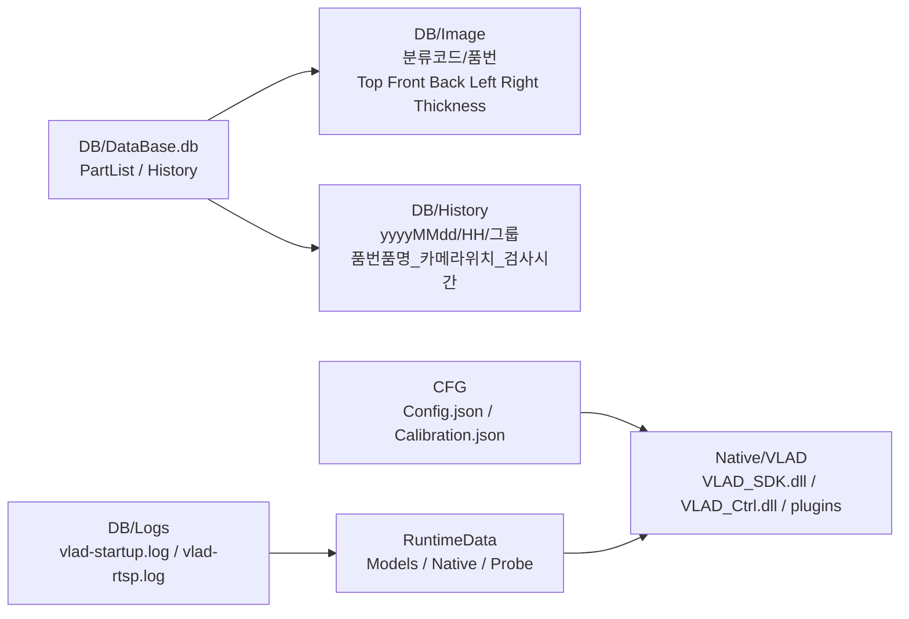

> 참고: 이 문서는 해당 날짜의 기록입니다. 최신 구조는 project-structure-2026-06-22.md를 기준으로 확인합니다.

# 프로젝트 구조도 - 2026-06-19

이 문서는 `AI-Vision IO Inspector`의 현재 코드 구조, 실행 흐름, 저장 구조, 미비/추가 개발 항목, 용량 증가 원인을 2026-06-19 기준으로 정리한 문서입니다.

## 전체 폴더 구조

```text
AI-Vision IO Inspector
|-- Docs
|   |-- 00-inbox
|   |   |-- documents        # 메일/전달 자료 원본, VLAD Source, 모델 checkpoint 등
|   |   `-- mail             # 수신 메일 원본
|   |-- 01-requirements
|   |-- 02-design
|   |-- 03-development
|   |   |-- project-structure-2026-06-19.md
|   |   |-- open-items.md
|   |   |-- changelog.md
|   |   |-- work-log.md
|   |   `-- vision
|   |       |-- README.md
|   |       |-- vision-implementation-checklist.md
|   |       |-- native-deployment.md
|   |       |-- vlad-imv-conversion-guide.md
|   |       `-- vlad-ops-env-start-map-2026-06-15.md
|   |-- 04-meetings
|   `-- 05-simulator
|       |-- Scanner           # EPSON ES-C320W OCR 샘플
|       |-- barcode-scanner   # 바코드 리딩 샘플
|       `-- epson_scan_api
|-- Tests
|   |-- AI-Vision IO Inspector-YYYY-MM-DD.zip  # 날짜별 수동 백업, 보존 대상
|   `-- AI-Vision IO Inspector
|       |-- AI.Vision.IOInspector.sln
|       |-- AI.Vision.IOInspector.App
|       |-- AI.Vision.IOInspector.Application
|       |-- AI.Vision.IOInspector.Domain
|       |-- AI.Vision.IOInspector.Infrastructure
|       |-- AI.Vision.IOInspector.Vision
|       |-- AI.Vision.IOInspector.VisionWorker
|       |-- CFG
|       |-- DB
|       |-- Native
|       |-- RuntimeData
|       `-- publish
`-- .git
```

## 솔루션 구조



## 프로젝트별 책임

| 프로젝트 | 현재 책임 | 주요 진입점 | 2026-06-19 기준 남은 항목 |
| --- | --- | --- | --- |
| `AI.Vision.IOInspector.App` | WPF 화면, 검색, 검사 시작/초기화, 기준 이미지 표시, 이력/통계/옵션 UI, 앱 시작 시 VLAD 초기화 요청 | `AppBootstrapper.cs`, `MainWindow.xaml`, `MainWindowViewModel.cs` | 6채널 장시간 UI 갱신 검증, 고객 최종 UI 피드백 반영, 통계 필터 확정 |
| `AI.Vision.IOInspector.Application` | 검사 순서 제어, 카메라 캡처 호출, AI 추론 호출, 측정값 비교, OK/NG 판정, 이력 저장 요청 | `InspectionWorkflowService.cs`, `MeasurementService.cs`, `JudgmentService.cs` | AI 결과 스키마 확정 후 측정부별 NG 사유 표시 고도화 |
| `AI.Vision.IOInspector.Domain` | 부품, 측정부, 기준 이미지, 검사 결과, 이벤트 모델 | `Part.cs`, `MeasurementRegion.cs`, `Inspection.cs`, `CapturedImage.cs` | 두께 복수 측정 요구가 확정되면 모델 확장 필요 |
| `AI.Vision.IOInspector.Infrastructure` | SQLite, 기준 이미지 파일 관리, 검사 이력 저장, Native DLL 검색/선로드, VisionWorker 프로세스 호출 | `SqliteDatabase.cs`, `SqlitePartRepository.cs`, `SqliteInspectionRepository.cs`, `NativeDependencyLoader.cs`, `ProcessIsolatedAiInferenceService.cs` | 장비 PC 배포 검증, History 보관 정책 확정, Excel 직접 업로드 필요 여부 판단 |
| `AI.Vision.IOInspector.Vision` | 카메라 Coordinator/Worker, RTSP/IMV/VLAD 호환 계층, VLAD 추론 엔진, 결과 파서, 런타임 preflight | `VisionRuntimeFactory.cs`, `VisionCameraCoordinator.cs`, `VladVisionInferenceEngine.cs`, `LegacyVlad/*`, `VladRuntimePreflight.cs` | VLAD 최종 모델 등록/추론, detectData 치수 스키마, pixel-mm 보정, RTSP stop API 확인 |
| `AI.Vision.IOInspector.VisionWorker` | WPF 본체 밖에서 VLAD 초기화/추론을 실행하는 격리 프로세스 | `Program.cs` | `cudnn64_8.dll` 배치, checkpoint-only 모델을 추론용 export 모델로 교체, 실제 추론 결과 JSON 검증 |
| `Docs/05-simulator/Scanner` | EPSON ES-C320W 스캔 OCR 샘플 | `ScannerSample.sln`, `ScannerWorkflowService.cs` | PaddleOCR 병행 판단 검증, 실제 라벨 20장 이상으로 추출 안정성 확인 |

## 앱 시작 흐름



현재 PC 기준으로는 `cudnn64_8.dll`이 없고, `RuntimeData\Models\VLAD\Ex_Weight`가 checkpoint-only 구조이므로 `WORKER_SKIPPED`가 정상 동작입니다. 이 처리는 검사 업무 조건을 차단하는 것이 아니라, 네이티브 SDK 호출 즉시 프로세스가 죽는 상황을 피하기 위한 보호 장치입니다.

## 검사 실행 흐름



## VLAD 관련 현재 기준

| 항목 | 현재 상태 |
| --- | --- |
| 공식 진입점 | `LegacyVlad/VLAD_Ops_Ai.cs` |
| Env Start 관리 | `VladSdkSession`과 `VladStartupInitializationService`가 중복 호출을 제어 |
| RTSP Thread | `LegacyVlad/VLAD_Ops_RTSP.cs`에 원본 함수명과 유사하게 유지 |
| 제거한 중복 계층 | `VLAD_Ops_Ai_Compat`, `VladFunctionAdapter`, `VladRuntimeContext` |
| Native P/Invoke | `VladNativeMethods.cs` |
| 결과 파싱 | `VladInferenceResultParser.cs` |
| Worker 보호 | `VladRuntimePreflight.cs`, 실패 결과 JSON 반환 |

## 데이터 저장 구조



| 저장 대상 | 현재 위치 | 관리 기준 | 주의 사항 |
| --- | --- | --- | --- |
| 부품 기준정보 | `Tests/AI-Vision IO Inspector/DB/DataBase.db` | SQLite, 품번/품명/분류코드/분류설명/구분/측정부/기준 이미지 | 실제 DB이므로 임의 삭제 금지 |
| 기준 이미지 | `DB/Image` | Top/Front/Back/Left/Right/Thickness 6개 위치 | 프로그램이 임의 삭제하지 않도록 유지 |
| 검사 이미지 | `DB/History` | 연월일/시간/그룹 단위 분산 저장 | 운영 PC에서는 별도 HDD 경로 지정 필요 |
| 검사/시작 로그 | `DB/Logs` | VLAD 시작/RTSP/검사 오류 추적 | 장애 분석에 필요하므로 일정 기간 보관 |
| Native DLL | `Native/VLAD`, `RuntimeData/Native` | VLAD/VLC/OpenCV/MVSDK/TensorFlow 런타임 | 실행 필수 파일이므로 정리 시 주의 |
| VLAD 모델 | `RuntimeData/Models/VLAD/Ex_Weight` | 추론용 export 모델 필요 | 현재 checkpoint-only 구조라 추론 등록 미완료 |

## 2026-06-19 용량 점검

현재 `AI-Vision IO Inspector` 루트의 주요 용량은 다음과 같습니다.

| 위치 | 용량 | 판단 |
| --- | ---: | --- |
| `Tests` | 약 10,203 MB | 날짜별 ZIP 백업과 RuntimeData/Native/DB가 대부분 |
| `Docs` | 약 5,632 MB | `00-inbox` 원본자료가 대부분 |
| `.git` | 약 897 MB | 과거 대용량 파일 이력 또는 pack 파일 영향 |

가장 큰 파일/폴더는 다음입니다.

| 항목 | 용량 | 삭제/정리 판단 |
| --- | ---: | --- |
| `Tests\AI-Vision IO Inspector-2026-06-19.zip` | 약 3,056 MB | 수동 백업 파일. 사용자 지시에 따라 삭제하지 않고 보존 |
| `Tests\AI-Vision IO Inspector-2026-06-16.zip` | 약 2,056 MB | 수동 백업 파일. 사용자 지시에 따라 삭제하지 않고 보존 |
| `Tests\AI-Vision IO Inspector-2026-06-15.zip` | 약 1,342 MB | 수동 백업 파일. 사용자 지시에 따라 삭제하지 않고 보존 |
| `Tests\AI-Vision IO Inspector-2026-06-10.zip` | 약 947 MB | 수동 백업 파일. 사용자 지시에 따라 삭제하지 않고 보존 |
| `Tests\AI-Vision IO Inspector-2026-06-09.zip` | 약 885 MB | 수동 백업 파일. 사용자 지시에 따라 삭제하지 않고 보존 |
| `AI.Vision.IOInspector.App\bin` | 약 7 MB | 2026-06-19 정리 후 x64 Debug 산출물. Native/VLAD 및 불필요한 runtimes 중복 복사 제거됨 |
| `AI.Vision.IOInspector.VisionWorker\bin` | 약 3.4 MB | 2026-06-19 정리 후 x64 Debug 산출물. Native/VLAD 및 불필요한 runtimes 중복 복사 제거됨 |
| `Native\VLAD` | 약 671 MB | 실행 필수 DLL. 삭제 금지 |
| `RuntimeData` | 약 487 MB | 모델/런타임/진단 자료. 추론 검증 전 삭제 금지 |
| `Docs\00-inbox\documents` | 약 5,529 MB | 원본 수신자료. 보존 또는 별도 아카이브 대상 |

용량 증가의 핵심 원인은 두 가지입니다.

1. 날짜별 ZIP 백업이 `Tests` 폴더에 계속 누적되고 있습니다. 현재 ZIP 파일만 약 8.7 GB 수준입니다. 단, ZIP 백업은 사용자 지시에 따라 삭제하지 않습니다.
2. 기존 Debug 빌드에서는 `tensorflow.dll` 같은 대형 네이티브 DLL이 App, VisionWorker, App 하위 `VisionWorker` 출력 폴더 등에 반복 복사됐습니다. 같은 DLL 하나가 약 383 MB이고 ZIP 내부에 7회 포함되어 3GB 이상 증가의 핵심 원인이 됐습니다.
3. 2026-06-19에 Debug 빌드에서는 솔루션 루트 `Native\VLAD` 한 곳만 참조하도록 변경했습니다. `Native\VLAD`와 `CFG`는 publish 산출물에만 복사됩니다.

## 필요한 위치에서만 생성 원칙

2026-06-19부터 Debug 빌드는 대용량 네이티브 파일을 여러 출력 폴더에 복사하지 않습니다. 개발 중에는 솔루션 루트의 `Native\VLAD`와 `CFG`를 직접 참조하고, 실제 배포용 `publish` 산출물을 만들 때만 필요한 DLL과 설정 파일을 포함합니다.

| 원칙 | 적용 내용 |
| --- | --- |
| Debug 산출물 최소화 | `Native\VLAD`, `CFG`는 `bin`으로 복사하지 않음 |
| 배포 산출물 보존 | `publish`에서는 `Native\VLAD`, `CFG`를 포함해 exe 단독 실행이 가능하도록 유지 |
| x64 고정 | `RuntimeIdentifier=win-x64`, `PlatformTarget=x64`로 AnyCPU/타 플랫폼 runtimes 산출물 생성을 방지 |
| Worker 중복 최소화 | App 출력에는 실행에 필요한 `VisionWorker.exe`와 managed DLL만 포함하고, 대형 VLAD DLL은 루트 공용 위치를 참조 |
| ZIP 백업 보존 | 날짜별 ZIP은 삭제하지 않되, 앞으로 새 ZIP을 만들 때는 `bin`, `obj`, `publish`, `.vs` 포함 여부를 먼저 확인 |

이 방식은 총량을 억지로 줄이는 것보다, 꼭 필요한 위치에서만 산출물이 생성되게 하는 방향입니다. 개발 산출물은 재빌드로 복구 가능해야 하고, DB/이미지/모델/백업 ZIP처럼 복구가 어려운 자료는 정리 대상에서 제외합니다.
## 정리 가능 항목

| 구분 | 대상 | 정리 방식 | 위험도 |
| --- | --- | --- | --- |
| 빌드 산출물 | `bin`, `obj`, `publish` | `dotnet clean` 또는 폴더 삭제 후 필요 시 재빌드 | 낮음 |
| 스캐너 샘플 산출물 | `Docs\05-simulator\Scanner\bin`, `obj`, `Scans` | 샘플 재실행 시 생성 가능. 필요한 스캔 원본만 보존 | 낮음~중간 |
| 받은 원본자료 | `Docs\00-inbox\documents` | 프로젝트 밖 장기보관 폴더로 이동 가능 | 중간, 근거 자료라 삭제 금지 |
| Git pack | `.git\objects\pack` | 대용량 이력 제거 후 `git gc` 필요 | 중간~높음, Git 히스토리 영향 |

## 삭제하면 안 되는 항목

- `Tests\AI-Vision IO Inspector\DB\DataBase.db`
- `Tests\AI-Vision IO Inspector\DB\Image`
- `Tests\AI-Vision IO Inspector\DB\History` 중 실제 검사 증빙 이미지
- `Tests\AI-Vision IO Inspector-YYYY-MM-DD.zip`
- `Tests\AI-Vision IO Inspector\Native\VLAD`
- `Tests\AI-Vision IO Inspector\CFG`
- `Tests\AI-Vision IO Inspector\RuntimeData\Models\VLAD` 중 AI 담당자가 제공한 모델 파일

## 2026-06-19 현재 잔여 항목

상세 기준은 `Docs/03-development/open-items.md`를 따릅니다.

| ID | 항목 | 상태 |
| --- | --- | --- |
| O-001 | 실제 카메라/NVR RTSP 연결 | 부분완료-검증필요 |
| O-002 | 연속 영상 미리보기 | 부분완료-검증필요 |
| O-003 | 트리거 방식 | 미구현-외부정보필요 |
| O-004 | pixel-mm 보정 | 미구현-내부작업 |
| O-005 | 렌즈 왜곡 보정 | 미구현-외부정보필요 |
| O-006 | VLAD 최종 모델 등록/추론 | 미구현-외부정보필요 |
| O-007 | VLAD/AI 결과 파싱 | 진행중 |
| O-008 | 기준 이미지 비교 정책 | 미구현-외부정보필요 |
| O-009 | RTSP Thread 종료 | 미구현-외부정보필요 |
| O-010 | 장비 PC 배포 | 부분완료-검증필요 |
| O-011 | 통계 화면 검증 | 부분완료-검증필요 |
| O-012 | Excel 직접 업로드 | 보류-범위조정 |
| O-013 | 두께 복수 측정 | 보류-범위조정 |
| O-014 | VLAD/TensorFlow CUDA 런타임 의존성 | 미구현-외부정보필요 |
| O-015 | 스캐너 OCR 품번 추출 안정화 | 부분완료-검증필요 |

## 우선 작업 순서

1. `O-014` cuDNN 8.x for CUDA 11.x 또는 VLAD 담당자 배포 세트 확보
2. `O-006` checkpoint-only 모델을 VLAD 추론용 export 모델로 교체
3. `O-007` AI 결과에서 길이/너비/높이/두께 반환 규격 확정
4. `O-001`, `O-002` 실제 6채널 장시간 스트리밍 검증
5. `O-004`, `O-005` pixel-mm/렌즈 보정 절차 확정
6. `O-010` 개발툴 없는 장비 PC 배포 검증
7. 용량 정리 정책 확정 후 bin/obj/publish 정리. ZIP 백업은 삭제하지 않음

## 2026-06-19 정리 결과

| 항목 | 결과 |
| --- | --- |
| 삭제한 산출물 | 재생성 가능한 `bin`, `obj`, `publish`, 시뮬레이터 `bin/obj` |
| 삭제하지 않은 항목 | ZIP 백업, DB, 기준 이미지, 검사 이력, `Native\VLAD`, `RuntimeData\Models` |
| 정리된 용량 | 약 3,135 MB 이상. 이후 win-x64 고정으로 불필요한 runtimes 산출물도 제거 |
| 새 x64 빌드 결과 | 경고 0개, 오류 0개 |
| App bin 용량 | 약 7 MB |
| VisionWorker bin 용량 | 약 3.4 MB |
| `bin` 하위 `Native\VLAD` 중복 생성 | 없음 |
| AnyCPU/기본 `bin\Debug` 산출물 | 없음 |
| `runtimes` 다중 플랫폼 산출물 | 없음. `RuntimeIdentifier=win-x64`로 Windows x64만 생성 |

## 개발자가 먼저 읽을 문서

| 대상 | 문서 |
| --- | --- |
| 전체 구조 | `Docs/03-development/project-structure-2026-06-19.md` |
| 남은 항목 | `Docs/03-development/open-items.md` |
| 변경 이력 | `Docs/03-development/changelog.md` |
| 작업 로그 | `Docs/03-development/work-log.md` |
| Vision 담당자 | `Docs/03-development/vision/README.md` |
| VLAD/IMV 변환 | `Docs/03-development/vision/vlad-imv-conversion-guide.md` |
| VLAD Env Start 대응 | `Docs/03-development/vision/vlad-ops-env-start-map-2026-06-15.md` |
| Native 배포 | `Docs/03-development/vision/native-deployment.md` |
