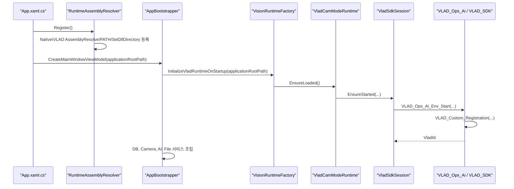
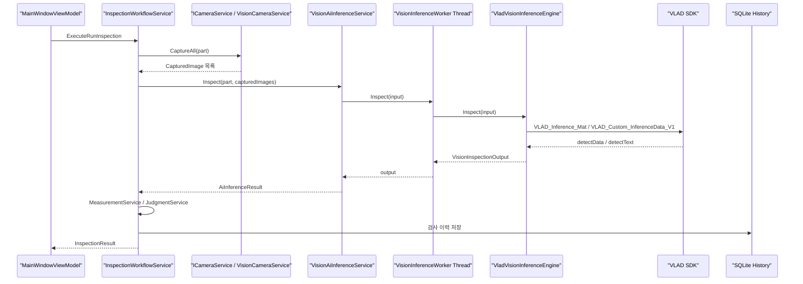

# Project Structure - 2026-06-22

기준일: 2026-06-22

현재 프로젝트는 Visual Studio 2022, .NET Framework 4.7.2, x64 전용 WPF MVVM 애플리케이션입니다. 2026-06-22 기준으로 문서와 코드 기준을 다시 맞췄습니다.

## 폴더 구조

```text
AI-Vision IO Inspector
|-- README.md
|-- Docs
|   |-- 00-project
|   |-- 00-inbox
|   |-- 01-requirements
|   |-- 02-design
|   |-- 03-development
|   |   |-- open-items.md
|   |   |-- changelog.md
|   |   |-- work-log.md
|   |   |-- project-structure-2026-06-22.md
|   |   |-- vision
|   |-- 04-meetings
|   |-- 05-simulator
|-- Tests
|   |-- AI-Vision IO Inspector
|       |-- AI.Vision.IOInspector.sln
|       |-- CFG
|       |   |-- Config.json
|       |   |-- HD_BackupConfig.json
|       |-- DB
|       |   |-- DataBase.db
|       |   |-- Image
|       |   |-- History
|       |   |-- Logs
|       |-- Native
|       |   |-- VLAD
|       |-- RuntimeData
|       |   |-- Models
|       |       |-- VLAD
|       |-- AI.Vision.IOInspector.App
|       |-- AI.Vision.IOInspector.Application
|       |-- AI.Vision.IOInspector.Domain
|       |-- AI.Vision.IOInspector.Infrastructure
|       |-- AI.Vision.IOInspector.Vision
|       |-- AI.Vision.IOInspector.VisionWorker
```

## 프로젝트 책임

| 프로젝트 | 현재 책임 | 주요 진입점 | 주의점 |
| --- | --- | --- | --- |
| `AI.Vision.IOInspector.App` | WPF UI, ViewModel, 앱 조립, 런타임 어셈블리 탐색 등록 | `App.xaml.cs`, `AppBootstrapper.cs`, `MainWindowViewModel.cs`, `RuntimeAssemblyResolver.cs` | UI 스레드 블로킹과 네이티브 SDK 종료 위험 주의 |
| `AI.Vision.IOInspector.Application` | 검사 워크플로우, 기준값 비교, 통계, PartDataStore | `InspectionWorkflowService`, `MeasurementService`, `JudgmentService`, `PartCatalogService` | UI/DB/Vision 구현체에 직접 의존하지 않음 |
| `AI.Vision.IOInspector.Domain` | Part, MeasurementRegion, ReferenceImage, Inspection 모델 | `Models` | 순수 모델 계층 유지 |
| `AI.Vision.IOInspector.Infrastructure` | SQLite, 기준 이미지 파일 관리, 검사 이미지 경로, Native DLL 경로 등록 | `SqliteDatabase`, `SqlitePartRepository`, `SqliteInspectionRepository`, `NativeDependencyLoader` | `System.Memory` 등 net472 바인딩 리다이렉트 확인 필요 |
| `AI.Vision.IOInspector.Vision` | 카메라 서비스, VLAD SDK 연결, RTSP/Direct SDK 경계, AI 추론 변환 | `VisionRuntimeFactory`, `VisionCameraService`, `VisionAiInferenceService`, `VladVisionInferenceEngine` | 현재 WPF 프로세스 안에서 VLAD 초기화/추론 수행 |
| `AI.Vision.IOInspector.VisionWorker` | 현재 기본 WPF 실행 흐름에서는 사용하지 않는 진단/레거시 워커 | `Program.cs` | 삭제 전 AI 담당자 진단 도구 필요 여부 확인 |

## 앱 시작 흐름



## 검사 시작 흐름



## 런타임 데이터와 출력 폴더

소스 기준 런타임 폴더는 `Tests\AI-Vision IO Inspector` 바로 아래에 둡니다.

| 폴더 | 용도 | 출력 복사 |
| --- | --- | --- |
| `CFG` | `Config.json`, `HD_BackupConfig.json`, 보정/옵션 설정 | `bin\x64\<Config>\net472\CFG` |
| `DB` | SQLite DB, 기준 이미지, 검사 이미지, 로그 | `DataBase.db`, `Image` 복사, `History/Logs` 생성 |
| `Native\VLAD` | VLAD_SDK, VLAD_Ctrl, OpenCvSharp, MVSDK_Net, VLC plugins, TensorFlow 관련 DLL | `bin\x64\<Config>\net472\Native\VLAD` |
| `RuntimeData\Models` | VLAD 모델 파일 | `bin\x64\<Config>\net472\RuntimeData\Models` |

출력 폴더 기준 배포 구조는 다음과 같습니다.

```text
AI.Vision.IOInspector.App.exe
AI.Vision.IOInspector.*.dll
CFG\
DB\
  DataBase.db
  Image\
  History\
  Logs\
Native\
  VLAD\
RuntimeData\
  Models\
```

## 2026-06-22 검증 기준

| 항목 | 결과 |
| --- | --- |
| Target Framework | 전체 메인 솔루션 `net472` |
| Platform | `Directory.Build.props` 기준 x64 고정 |
| Debug 빌드 | 확인 필요 시 `dotnet build ... -c Debug -p:Platform=x64` 사용 |
| Release 빌드 | 확인 필요 시 `dotnet build ... -c Release -p:Platform=x64` 사용 |
| 앱 시작 smoke | 최근 코드 기준 8초 유지 테스트 통과 |
| OpenCvSharp 로드 오류 | `RuntimeAssemblyResolver` 추가로 `Native\VLAD` 하위 관리 DLL 탐색 대응 |
| 외부 런타임 | CUDA/cuDNN/VC++ Runtime은 설치/배치 확인 필요 |

## 정리된 구조 변경

| 날짜 | 내용 |
| --- | --- |
| 2026-06-22 | 메인 프로젝트 기준을 `.NET Framework 4.7.2 + x64`로 문서화 |
| 2026-06-22 | WPF 기본 실행 경로를 `VisionWorker.exe` 격리 프로세스가 아닌 in-process `VisionInferenceWorker` 스레드 흐름으로 정리 |
| 2026-06-22 | `ProcessIsolatedAiInferenceService`, `VladStartupInitializationService` 제거 상태를 문서에 반영 |
| 2026-06-22 | `RuntimeAssemblyResolver`로 `Native\VLAD` 하위 관리 DLL 탐색 문제 해결 상태 반영 |
| 2026-06-22 | `CFG/DB/Native/VLAD/RuntimeData/Models` 출력 복사 구조를 배포 기준으로 문서화 |

## 앞으로 개발해야 할 부분

잔여 항목의 상세 상태는 `open-items.md`를 기준으로 관리합니다. 특히 다음 항목은 AI 담당자 또는 실제 장비 검증 없이는 완료 처리하지 않습니다.

- VLAD 최종 모델 구조 확인
- CUDA/cuDNN/VC++ Runtime 배포 방식 확정
- 6채널 RTSP/NVR 장시간 수신 테스트
- `detectData`/`detectText` 결과 스키마 확정
- pixel-mm 보정값 확정
- History 자동 보존/삭제 정책 확정
