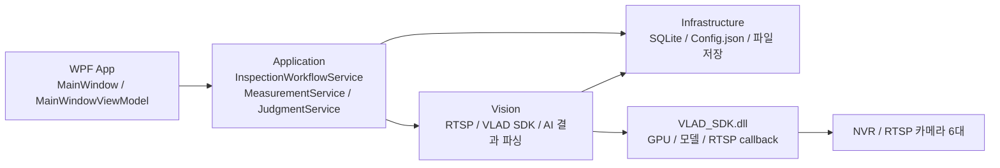
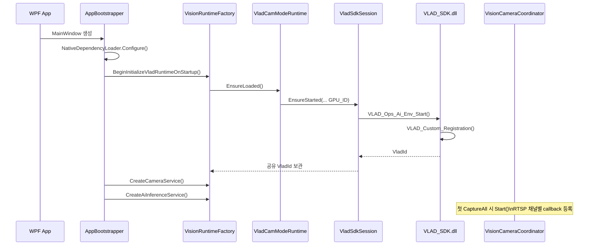
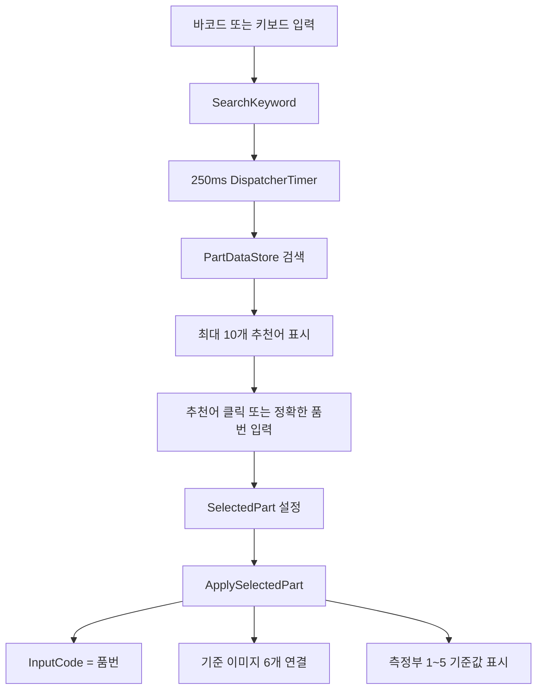
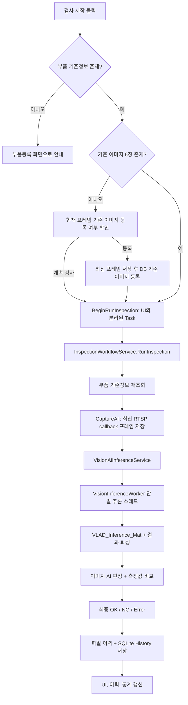
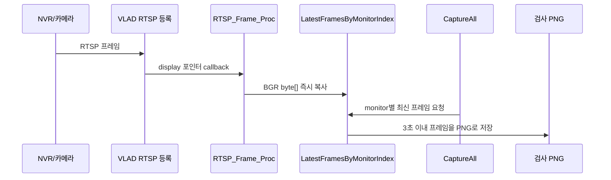

# Vision 담당자 교육 자료

작성일: 2026-07-13  
대상: AI/Vision 담당자, WPF 연동 담당자  
기준 코드: `Tests/AI-Vision IO Inspector`, .NET Framework 4.7.2, x64 WPF MVVM

<style>
@media print {
  .print-page-break { break-after: page; page-break-after: always; }
}
</style>

> 인쇄 권장: 문서를 PDF 또는 브라우저 인쇄 미리보기로 열고, 용지는 A4 가로 방향, `페이지당 2페이지`를 선택합니다. 아래 구분선은 설명 단위의 페이지 나눔입니다.

## 1. 이 자료의 목적

이 프로그램은 부품 기준정보를 SQLite DB에서 읽고, 6대 RTSP 카메라에서 확보한 검사 이미지를 VLAD SDK에 전달한 뒤, 이미지 AI 판정과 측정값 기준 비교를 한 번의 검사에서 함께 수행한다.

Vision 담당자는 UI나 SQLite 저장 로직을 직접 수정하기보다 `AI.Vision.IOInspector.Vision` 프로젝트의 VLAD SDK 연결부, RTSP 프레임 수신부, AI 결과 파서에 집중한다. App과 Application 프로젝트는 Vision 결과를 화면, 이력, 통계로 연결하는 영역이다.

먼저 다음 문서를 순서대로 읽는다.

1. `vision-project-boundary.md`
2. `native-deployment.md`
3. `ai-result-contract.md`
4. `inspectmat-context-json.md`
5. `vision-implementation-checklist.md`
6. 이 문서

## 2. 전체 구조와 책임 경계



| 영역 | 주 책임 | Vision 담당자가 수정할 때 주의할 점 |
| --- | --- | --- |
| App | 탭, Search DB, 검사 버튼, 이미지/결과 표시 | Vision 네이티브 호출을 UI 스레드에 직접 넣지 않는다. |
| Application | 부품 조회, 캡처, AI 호출, 기준 비교, 최종 판정 순서 | `InspectionWorkflowService`의 호출 순서는 유지한다. |
| Infrastructure | `DataBase.db`, `Config.json`, 기준/이력 파일 경로 | 기준 이미지와 검사 이력의 저장 정책을 AI 코드에서 임의로 바꾸지 않는다. |
| Vision | VLAD 등록, RTSP callback, 최신 프레임, Mat, 결과 파싱 | SDK export, calling convention, 포인터 수명, 프레임 크기를 실제 DLL과 일치시킨다. |
| VLAD SDK | 모델 로드, RTSP 수신, 추론, Draw/TLV 결과 생성 | DLL이 제공하는 실제 함수 계약이 C# P/Invoke 선언의 기준이다. |

<div class="print-page-break"></div>

## 3. 프로그램 시작 및 Initial 흐름

### 3.1 실행 흐름



### 3.2 코드 진입점

| 순서 | 코드 | 역할 |
| --- | --- | --- |
| 1 | `AI.Vision.IOInspector.App/AppBootstrapper.cs` `CreateMainWindowViewModel()` | Native DLL 경로 설정, Vision 초기화 예약, 서비스 조립 |
| 2 | `AI.Vision.IOInspector.Vision/VisionRuntimeFactory.cs` `BeginInitializeVladRuntimeOnStartup()` | WPF 시작 흐름에서 VLAD 초기화를 한 번만 수행 |
| 3 | `LegacyVlad/VladVisionSettings.cs` `Load()` | `CFG/Config.json`에서 MODEL, GPU_ID, LAST_MODE, LAST_USER를 읽음. `AI_VISION_VLAD_GPU` 환경변수가 있으면 GPU_ID보다 우선 |
| 4 | `LegacyVlad/VladCamModeRuntime.cs` `EnsureLoaded()` | CAM 모드 상태를 만들고 공유 세션에 등록을 요청 |
| 5 | `LegacyVlad/VladSdkSession.cs` `EnsureStarted()` | 프로세스 안의 `VladId` 재사용. 등록 mutex로 중복 등록 방지 |
| 6 | `LegacyVlad/VLAD_Ops_Ai.cs` `VLAD_Ops_Ai_Env_Start()` | `VLAD_Custom_ID_Generate()` 후 `VLAD_Custom_Registration()` 호출 |

### 3.3 VladId, GPU, 재초기화 규칙

- `VladId`는 `VLAD_Custom_Registration()`이 반환하는 네이티브 세션 핸들이다.
- 일반 실행에서는 Initial 때 한 번 생성하고, 이후 검사와 RTSP 등록에서 같은 `VladId`를 재사용한다.
- 현재 설정은 `CFG/Config.json`의 `CUSTOM.HD.GPU_ID`를 사용한다. 단 `AI_VISION_VLAD_GPU` 환경변수가 있으면 그 값이 우선한다.
- 실행 중 GPU_ID를 바꾸면 기존 `VladId`, TensorFlow GPU 컨텍스트, RTSP callback 등록 상태가 달라질 수 있다. 따라서 Config 변경만으로 즉시 GPU를 바꾸지 않으며, 프로그램 완전 종료 후 재시작하거나 `VLAD_Unregistration -> VLAD_Ops_Ai_Env_Start -> RTSP 재등록` 순서로 재초기화해야 한다.
- 최근 로그에서 GPU가 1개만 보이는 PC에 `GPU_ID=1`을 지정해 네이티브 오류가 난 사례가 있었다. 현재 시험 설정은 `GPU_ID=0`이다. 실제 GPU 번호는 AI 담당자가 현장 PC에서 확인한다.

### 3.4 RTSP Initial과 실제 카메라 등록

`VLAD_Ops_Ai_Env_Start()`는 기본 RTSP URL이 있으면 monitor 0으로 `VLAD_Rtsp_Info_Client_Registration()`을 호출한다. 이후 실제 검사 경로에서 `VisionCameraCoordinator.Start()`가 활성화된 RTSP 채널을 읽어 Top/Front/Back/Left/Right/Thickness 순서의 monitor index 0~5에 등록한다.

| ViewType | MonitorIndex |
| --- | --- |
| Top | 0 |
| Front | 1 |
| Back | 2 |
| Left | 3 |
| Right | 4 |
| Thickness | 5 |

6개 카메라 운용 시 `CFG/Config.json`의 CAM0~CAM5는 서로 다른 실제 RTSP URL이어야 한다. 같은 URL이 여러 개면 화면과 callback이 중복되어 채널별 검사 의미가 사라진다.

<div class="print-page-break"></div>

## 4. Search DB에서 검사 대상 선택 흐름

Search DB는 검사 대상으로 쓸 부품을 고르는 작업대이며, DB 조회/확인과 부품등록 탭의 선택 상태와 분리되어 있다.



| 코드 | 역할 |
| --- | --- |
| `MainWindowViewModel.LoadParts()` | 프로그램 시작 시 SQLite 기준정보를 `PartDataStore` 메모리에 적재 |
| `SearchKeyword` / `QueueMainSearchRefresh()` | 입력 중 과도한 검색을 막기 위해 250ms 지연 처리 |
| `RefreshMainSearchSuggestions()` | 전역 키워드 기준 추천어를 최대 10개 생성 |
| `ApplyInspectionPartFromMainSearch()` | Search DB 전용 `SelectedPart`를 설정 |
| `ApplySelectedPart()` | `InputCode`, 기준 이미지, 측정부 표시를 동시에 갱신 |

부품 등록이나 DB 조회 화면에서 저장/삭제가 일어나면 `PartDataStore`와 화면 목록을 새로 고친다. 이때 Search DB의 선택 대상은 같은 품번일 때만 새 데이터로 연결하고, 다른 탭의 선택으로 검사 대상이 바뀌지 않도록 관리한다.

<div class="print-page-break"></div>

## 5. 검사 버튼부터 이력 저장까지

### 5.1 사용자 흐름



### 5.2 Application 핵심 흐름

`AI.Vision.IOInspector.Application/Services/InspectionWorkflowService.cs`의 `RunInspection()`은 검사 순서를 보장하는 중심 메서드다.

1. `IPartRepository.GetByPartNo(inputCode)`로 SQLite에서 부품 기준정보를 다시 읽는다.
2. 측정부가 있고 `{품번}_coordinate.png`가 존재하면, 이번 검사에 사용하는 메모리상 Part의 Thickness 기준 이미지 경로만 coordinate 이미지로 바꾼다. DB와 원래 Thickness 파일은 변경하지 않는다.
3. `CaptureAll(part)`로 6개 검사 이미지를 얻어 `Inspection.Images`에 연결한다.
4. `RunAiInspection(part, capturedImages)`에서 Vision 서비스에 전달한다.
5. `CompareReference(part, inferenceResult)`에서 AI 측정값과 DB 기준값/허용오차를 비교한다.
6. `BuildFinalInspectionResult()`가 이미지 AI 판정과 모든 측정부 판정을 함께 이용해 OK/NG를 만든다.
7. 성공, NG, Error 어느 경우든 `TrySaveInspection()`으로 이력 저장을 시도한다.

최종 판정 규칙은 다음과 같다.

| 조건 | 최종 결과 |
| --- | --- |
| AI 실행 자체 실패, 캡처 실패, 부품 미등록 | Error |
| `IsMatched=false` | NG |
| 어떤 측정부라도 기준 범위를 벗어나거나 AI 측정값이 없음 | NG |
| 이미지 AI 일치 및 모든 측정부 범위 충족 | OK |

`MeasurementService`는 현재 단위를 mm로 고정한다. AI가 `100`을 반환하면 `100mm`로 해석하고, `기준값 + ToleranceMin`부터 `기준값 + ToleranceMax` 범위와 비교한다. pixel-mm 보정, cm/m 변환은 Application에서 하지 않으며 AI/DLL 책임이다.

<div class="print-page-break"></div>

## 6. RTSP callback과 검사 이미지 캡처

### 6.1 현재 방식

검사 버튼을 누를 때마다 ffmpeg, VLC, OpenCV로 RTSP 연결을 새로 여는 방식은 사용하지 않는다. 실행 중 등록된 VLAD RTSP callback의 최신 프레임을 메모리에 보관하고, 검사 시 그 프레임을 PNG 파일로 저장한다.



| 코드 | 역할 |
| --- | --- |
| `LegacyVlad/VLAD_Ops_RTSP.cs` `VLAD_Ops_RTSP_Frame_Proc()` | SDK callback의 `display` 포인터를 즉시 관리 메모리 `byte[]`로 복사 |
| `CacheLatestFrame()` | monitor별 최신 프레임과 수신 시각을 보관. 최소 200ms 간격으로 캐시 갱신 |
| `TrySaveLatestFrame()` | 최신 프레임이 3초 이내인지 확인하고 PNG로 저장. 최신 프레임이 없으면 최대 10초 대기 |
| `VisionCameraCoordinator.CaptureVladRtsp()` | 검사 버튼의 RTSP 캡처 진입점. RTSP 재접속 없이 캐시 프레임 저장 |
| `VisionCameraCoordinator.CaptureAll()` | 활성 채널별 Capture Worker 요청을 먼저 모두 넣고, Top~Thickness 순서로 결과 수집 |

### 6.2 RTSP 담당자 주의 사항

- `CAM_WIDTH`, `CAM_HEIGHT`는 실제 RTSP 프레임의 폭/높이와 반드시 같아야 한다. callback은 `width * height * 3`만큼 `Marshal.Copy`하므로 틀리면 이미지 저장 실패나 네이티브 메모리 문제가 생길 수 있다.
- 프레임은 callback에서만 캐시한다. callback이 수신되지 않으면 검사 시 `최신 프레임이 아직 수신되지 않았습니다` 또는 timeout이 난다.
- callback 기본 동작은 최신 프레임 캐시이며, 연속 추론 `StartFrameProcessing()`은 현재 검사 흐름에서 호출하지 않는다. 검사 한 건의 추론은 별도 `VisionInferenceWorker`가 수행한다.
- RTSP URL, 계정, NVR 채널, 코덱(H.264/H.265), 해상도, FPS는 먼저 VLC 또는 ffmpeg 단독 테스트로 확인한다.

<div class="print-page-break"></div>

## 7. AI 호출과 결과 파싱

### 7.1 스레드와 잠금

| 실행 단위 | 담당 코드 | 역할 |
| --- | --- | --- |
| WPF UI 스레드 | `MainWindowViewModel` | 버튼, 화면 상태, 이력/통계 갱신. VLAD 직접 호출 금지 |
| ThreadPool Task | `BeginRunInspection()` -> `RunInspectionOnWorker()` | Application 검사 흐름 실행 |
| 단일 Vision 추론 스레드 | `Threading/VisionInferenceWorker.cs` | AI 요청 큐를 순차 처리. 전체 대기 timeout은 현재 180초 |
| 채널별 Capture Worker | `VisionCameraCaptureWorker` | 활성 카메라별 최신 callback 프레임을 파일로 저장 |
| SDK callback 스레드 | `VLAD_Ops_RTSP_Frame_Proc` | 프레임 캐시. 기본적으로 검사 추론을 수행하지 않음 |

`VLAD_Ops_Ai.NativeInferenceSyncRoot`은 네이티브 추론과 결과 파싱을 직렬화한다. 따라서 6장 이미지는 현재 동시에 추론되지 않고 순서대로 `VLAD_Inference_Mat`을 호출한다. 한 장이 15~20초면 6장은 90~120초가 될 수 있으므로, 180초 timeout은 임시 방어 값이며 성능 문제의 해결책은 아니다.

### 7.2 실제 호출 경로

```text
InspectionWorkflowService.RunAiInspection
  -> VisionAiInferenceService.Inspect
  -> VisionInspectionInput 생성
  -> VisionInferenceWorker.Inspect (요청 큐)
  -> VladVisionInferenceEngine.Inspect
  -> OpenCvSharpMatImage.LoadFromFile
  -> 1920x1080, CV_8UC3 Mat 정규화
  -> VLAD_Ops_Ai.VLAD_HD_Inference_Mat(
       fullImageVladId, croppedImageVladId, mat.CvPtr, threshold, 1, inspectionContextJson)
  -> 현재 배포 DLL 호환 경로: VLAD_Inference_Mat(fullImageVladId, mat.CvPtr, threshold, 1)
  -> VladInferenceResultParser.Parse
  -> VladMeasurementMapper
  -> AiInferenceResult
```

### 7.3 결과 데이터 처리

`VladInferenceResultParser.FillDrawResult()`는 SDK의 Draw 함수를 이용해 `detectText`, class count, TLV(`Custom_Info_Struct`)를 받는다. TLV 버퍼는 `Marshal.AllocHGlobal()`로 할당하고, `Marshal.PtrToStructure()`로 관리 메모리에 복사한 뒤에만 `FreeHGlobal()` 한다. 따라서 포인터를 해제한 뒤 결과를 읽는 구조는 아니다.

현재 애플리케이션 결과 계약은 다음 문자열이다.

```text
isMatched,score,measurement1,measurement2,...,measurementN
true,98,100,159,25,47
```

| 위치 | 예시 | Application 해석 |
| --- | --- | --- |
| 0 | `true` | 이미지 AI 일치(PASS) |
| 1 | `98` | confidence 0.98 |
| 2 이후 | `100`, `159` ... | IndexNo 오름차순의 측정부 측정값, 단위 mm |

`VladMeasurementMapper`는 IndexNo 순서의 측정값을 `MeasurementRegion.Id`에 매핑한다. DB 비교는 ID를 기준으로 하므로, AI가 반환하는 측정값 순서는 반드시 부품의 `MeasurementRegion.IndexNo` 순서와 같아야 한다.

### 7.4 중요: inspectionContextJson의 현재 상태

`VladVisionInferenceEngine.BuildInspectionContextJson()`은 품번, 이미지 ViewType, 측정부 1~5의 IndexNo, 항목, 색상, 기준값, 허용오차, 좌표, mm 단위를 JSON으로 만든다.

목표 HD DLL의 C# 진입점은 아래처럼 두 ID를 모두 받는다.

```csharp
VLAD_HD_Inference_Mat(
    fullImageVladId,
    croppedImageVladId,
    rawMatPointer,
    threshold,
    drawMode,
    inspectionContextJson)
```

그러나 현재 운영 DLL에 실제로 호출하는 `VLAD_Inference_Mat` export는 **레거시 단일 ID 4인자**다.

```csharp
VLAD_Inference_Mat(fullImageVladId, rawMatPointer, threshold, drawMode)
```

따라서 현재 C#의 HD wrapper는 두 ID를 보관·전달받지만, 현행 DLL에는 `fullImageVladId`만 전달한다. `croppedImageVladId`와 `inspectionContextJson`은 새 HD export가 제공될 때까지 실제 native 추론에 쓰이지 않는다. AI가 좌표/기준값 JSON과 두 ID를 DLL 내부 추론에 사용해야 한다면, 담당자는 다음 중 하나를 확정해야 한다.

1. 두 ID와 JSON을 받는 실제 VLAD HD DLL export와 정확한 P/Invoke 서명 제공
2. 별도 `SetInspectionContext(vladId, json)` API 제공
3. 기존 Custom_Para/TLV 구조에 측정부 정보를 넣는 공식 계약 제공

이 계약이 확정되기 전에는 C#에서 만든 JSON을 AI 입력에 사용한다고 말하면 안 된다. 현재는 결과 매핑과 로그용 준비 데이터다.

<div class="print-page-break"></div>

## 8. 기준정보와 이력 DB 구조

`DB/DataBase.db`의 핵심 테이블은 다음과 같다.

| 목적 | 테이블 | 주요 내용 |
| --- | --- | --- |
| 부품 기준 | `PartList_Parts` | 품번, 품명, 분류코드, 분류설명, 구분 |
| 측정부 기준 | `PartList_MeasurementPoints` | IndexNo, 항목, ViewType, 기준값, 허용범위, mm, X1/Y1/X2/Y2, 색상 |
| 기준 이미지 | `PartList_ReferenceImages` | ViewType별 현재 파일 경로와 등록 시각 |
| 검사 헤더 | `History_Inspections` | 검사 ID, 부품 정보, 결과, 검사시각, 경과시간, 메시지 |
| 측정 이력 | `History_Measurements` | 기준값, 측정값, 허용범위, 판정, 메시지 |
| 캡처 이력 | `History_CapturedImages` | 검사별 카메라 위치, 이미지 파일 경로, 촬영 시각 |
| 이벤트 이력 | `History_Events` | source, severity, 메시지, 시각 |

`SqliteInspectionRepository.Save()`는 헤더, 측정값, 캡처 이미지 경로, 이벤트를 하나의 SQLite transaction 안에 저장한다. 파일 이력은 `SimulatedFileStorageService.StoreInspection()`에서 `OUTPUT_PATH/Inspection_Data/YYYY/MM/DD/HH/History|Image|Log/...` 구조로 남긴다.

## 9. Vision 담당자가 확인해야 할 로그

| 파일 | 언제 확인하는가 | 확인할 내용 |
| --- | --- | --- |
| `DB/Logs/vlad-startup.log` | 프로그램 시작/초기화 실패 | GPU_ID, MODEL 경로, `VLAD_Custom_Registration` 반환 VladId |
| `DB/Logs/vlad-rtsp.log` | 카메라 연결, 최신 프레임 없음 | 채널별 RTSP 등록, URL, callback 관련 실패 |
| `VLAD_SDK_Log.Fri` | 모델/GPU/네이티브 DLL 문제 | TensorFlow, CUDA, 모델 로드, GPU visible device, custom DLL 오류 |
| 이력 UI 및 `History_Events` | 검사 Error/NG | CaptureAll, RunAiInspection, CompareReference, 저장 실패 원인 |

네이티브 `AccessViolationException`은 C# 예외 처리만으로 완전히 안전하게 복구할 수 없다. 다음을 우선 대조한다.

1. x64 프로세스와 x64 VLAD/OpenCV DLL 조합
2. GPU_ID와 실제 visible GPU 수
3. `cudart64_110.dll`, `cudnn64_8.dll`, CUDA/cuDNN, VC++ Runtime
4. 모델 폴더와 SDK가 기대하는 export 구조
5. `Mat` 형식과 크기: 현재 `1920x1080`, `CV_8UC3`
6. RTSP `CAM_WIDTH/CAM_HEIGHT`와 실제 프레임 크기
7. P/Invoke 호출 규약, 함수 인자 수, 구조체 alignment/packing

<div class="print-page-break"></div>

## 10. 남은 잔건과 담당 구분

| ID | 남은 항목 | 담당 | 완료 기준 |
| --- | --- | --- | --- |
| V-01 | 최종 모델 배포 구조 확정 | AI/Vision | `VLAD_Custom_Registration` 후 모델 로드 성공이 재현되고 실제 추론까지 동작 |
| V-02 | AI 결과가 `detectText`인지 TLV인지 별도 export인지 확정 | AI/Vision | 실제 DLL 반환값 20건 이상을 결과 계약과 대조 |
| V-03 | 측정부 JSON을 DLL에 넘길 공식 API 확정 | AI/Vision | 좌표/기준값/색상/단위를 AI가 실제 입력으로 수신했다는 검증 로그 확보 |
| V-04 | 6대 RTSP의 고유 URL, 해상도, FPS, 코덱 확정 | Vision/설비 | CAM0~CAM5가 모두 다른 실제 카메라 영상을 30분 이상 안정 수신 |
| V-05 | 6장 순차 추론 성능 개선 또는 timeout 기준 합의 | AI/Vision | 실제 6장 검사 시간이 목표 takt time 안에 들어오고 180초 timeout 의존 제거/근거 확보 |
| V-06 | Native AccessViolation 원인 제거 | AI/Vision | 반복 100회 검사에서 프로세스 종료 및 native memory 오류 없음 |
| V-07 | CUDA/cuDNN/VC++ Runtime 배포 절차 확정 | Vision/배포 | 개발 도구 없는 신규 PC에서 x64 Release 폴더만으로 실행/검사 성공 |
| V-08 | 기준 이미지 없음 정책 확정 | 업무/AI | 등록 유도 후 계속 검사 허용 여부와 결과 의미가 현장 SOP와 일치 |
| V-09 | 학습 프로그램 실제 배치 파일 및 DONE 규약 확정 | AI/Vision | 학습 종료 후 `Unregistration -> Initial -> RTSP 재등록 -> 신모델 검사` 완료 |
| V-10 | 이력 보존/삭제 현장 검증 | App/운영 | HDD 기준 또는 보존일 기준 삭제 시 DB, Image, Log가 같은 날짜 단위로 정리 |

<div class="print-page-break"></div>

## 11. 교육 시연 순서

1. `CFG/Config.json`에서 MODEL, GPU_ID, CAM0~CAM5를 보여준다.
2. 프로그램 시작 후 `vlad-startup.log`에서 `VladId`와 ClassCount를 확인한다.
3. 옵션 화면에서 채널별 실제 연결 상태와 최신 수신 시각을 확인한다.
4. Search DB에서 품번/품명/분류 키워드로 한 부품을 선택하고, 기준 이미지와 측정부 1~5가 검사 화면에 반영되는 것을 보여준다.
5. 기준 이미지가 없는 부품에서 현재 프레임 등록 안내와 기준 이미지 저장을 시연한다.
6. 검사 시작 후 Event 영역에서 `CaptureAll -> RunAiInspection -> CompareReference -> BuildFinalInspectionResult` 순서를 확인한다.
7. 검사 완료 후 기준 이미지, 검사 이미지, OK/NG 테두리, 측정부 결과를 확인한다.
8. 이력 탭에서 검사 헤더/측정값/메시지를 확인하고, SQLite `History_*`와 출력 폴더 경로를 대조한다.
9. 의도적으로 RTSP URL 하나 또는 GPU_ID를 잘못 설정한 테스트 환경에서 로그 위치와 복구 절차를 설명한다. 운영 환경의 설정을 임의로 바꾸는 시연은 하지 않는다.

## 12. 담당자가 바로 작업할 파일

| 목적 | 파일 |
| --- | --- |
| VLAD 초기 등록/해제 | `AI.Vision.IOInspector.Vision/LegacyVlad/VLAD_Ops_Ai.cs`, `VladSdkSession.cs`, `VladCamModeRuntime.cs` |
| P/Invoke 선언 | `AI.Vision.IOInspector.Vision/LegacyVlad/VladNativeMethods.cs` |
| RTSP callback/캐시 | `AI.Vision.IOInspector.Vision/LegacyVlad/VLAD_Ops_RTSP.cs` |
| 카메라 채널 및 캡처 | `AI.Vision.IOInspector.Vision/Services/VisionCameraCoordinator.cs` |
| Mat 변환과 추론 호출 | `AI.Vision.IOInspector.Vision/Engines/VladVisionInferenceEngine.cs`, `LegacyVlad/OpenCvSharpMatImage.cs` |
| 결과 포인터/TLV 파싱 | `AI.Vision.IOInspector.Vision/LegacyVlad/VladInferenceResultParser.cs` |
| 결과 문자열/측정값 매핑 | `AI.Vision.IOInspector.Vision/Services/VladMeasurementMapper.cs` |
| App으로 반환하는 계약 | `AI.Vision.IOInspector.Vision/Services/VisionAiInferenceService.cs` |

문서 갱신 규칙: AI DLL export, 결과 문자열/TLV 구조, 모델 폴더 구조, GPU/CUDA 요구사항, RTSP URL 규칙이 바뀌면 이 문서와 `ai-result-contract.md`, `native-deployment.md`, `vision-implementation-checklist.md`를 같은 날짜로 함께 갱신한다.
